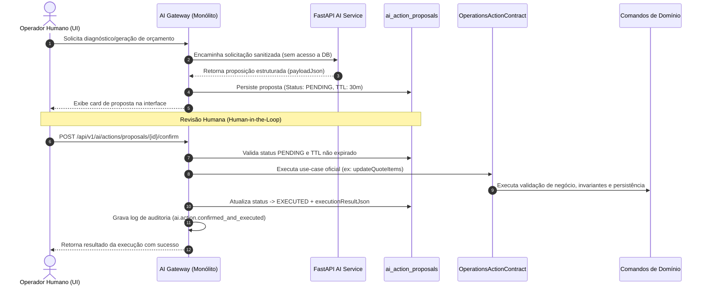
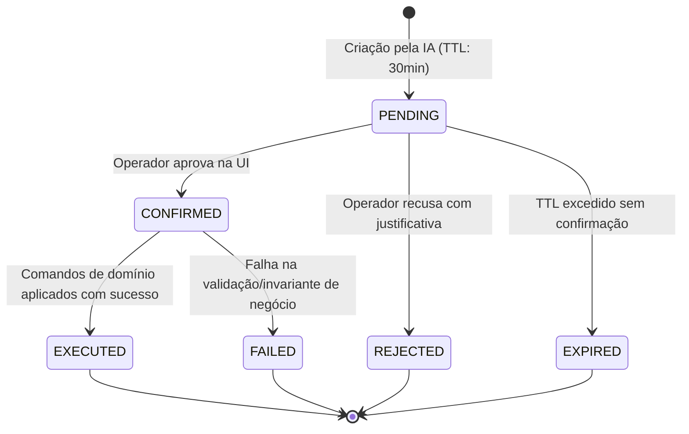

# Fluxo de Confirmação de Ações de IA (Human-in-the-Loop & Command Routing)

## 1. Visão Geral e Princípios Arquiteturais

No ecossistema **GoMech**, a Inteligência Artificial opera sob o princípio estrito de **Não-Autonomia de Estado de Negócio**:

> [!IMPORTANT]
> **Princípio Fundamental**: Modelos de IA e serviços autônomos **nunca** têm permissão para mutar diretamente o banco de dados de domínio ou executar comandos sem a expressa revisão e confirmação de um operador humano autenticado.



---

## 2. Máquina de Estados da Proposta de Ação

A tabela `ai_action_proposals` rastreia o ciclo de vida de cada proposta de ação gerada por IA:



### Estados:
1. **`PENDING`**: A proposta foi criada e aguarda confirmação humana. Possui um timer regressivo baseado em `expires_at` (TTL padrão: 30 minutos).
2. **`CONFIRMED` / `EXECUTED`**: O operador aprovou a proposta (com eventuais edições manuais de itens). O comando de domínio foi executado com sucesso.
3. **`REJECTED`**: O operador rejeitou a proposta, gravando obrigatoriamente a justificativa (`rejection_reason`).
4. **`EXPIRED`**: O tempo limite da proposta se esgotou. A proposta não pode mais ser executada.
5. **`FAILED`**: Ocorreu um erro na execução do comando de domínio (ex: violação de regra de negócio, concorrência otimista).

---

## 3. Roteamento de Comandos de Domínio

Em estrita conformidade com o **ADR-002** (comunicação cross-módulo apenas por contratos em `api/`), o módulo AI não acessa entidades internas ou repositórios de Operations. Em vez disso, ele interage com a interface pública:

```java
package com.gomech.api.modules.operations.api;

public interface OperationsActionContract {

    QuoteResponse applyProposedQuoteItems(
            UUID quoteId, UUID tenantId, UUID unitId, UUID userId, List<SaveQuoteItemRequest> items);

    WorkOrderResponse applyProposedWorkOrderItems(
            UUID workOrderId, UUID tenantId, UUID unitId, UUID userId, List<SaveWorkOrderItemRequest> items);

    AppointmentResponse scheduleAppointmentFromAiProposal(
            UUID tenantId, UUID unitId, CreateAppointmentRequest request);
}
```

### Tipos de Ação Suportados (`AiActionType`):
- `APPLY_QUOTE_ITEMS`: Aplicação de itens, peças e serviços recomendados em um Orçamento (`Quote`).
- `APPLY_WORK_ORDER_ITEMS`: Inclusão de serviços e peças adicionais em uma Ordem de Serviço (`WorkOrder`).
- `SCHEDULE_PREVENTIVE_APPOINTMENT`: Agendamento preventivo de revisão veicular (`Appointment`).
- `DRAFT_MESSAGE`: Rascunho assistido de comunicado ao cliente via WhatsApp/SMS.

---

## 4. Garantias de Segurança e Não-Repúdio

1. **Replay Protection & Idempotência**:
   - Bloqueio com `@Version private Long version;` (Locking Otimista).
   - Qualquer tentativa de reconfirmar uma ação não-`PENDING` dispara `AiActionAlreadyProcessedException` (HTTP 409 Conflict).
2. **TTL & Expiração Segura**:
   - Propostas têm validade fixa. Se o operador tentar confirmar após a expiração, o status transita para `EXPIRED` e a requisição falha com `AiActionExpiredException` (HTTP 410 Gone).
3. **Isolamento Multitenant & RBAC**:
   - Todas as consultas utilizam Row-Level Security (RLS) no PostgreSQL.
   - Permissões obrigatórias: `AI_ACTION_PROPOSE` para geração e `AI_ACTION_CONFIRM` para confirmação/rejeição.
4. **Auditoria Completa (Core Audit)**:
   - Todo evento de confirmação ou rejeição grava um log auditável com ator, unidade, tenant, timestamps e metadata via `AuditRecorder`.

---

## 5. Endpoints REST

| Método | Endpoint | Permissão | Descrição |
|---|---|---|---|
| `POST` | `/api/v1/ai/actions/proposals` | `AI_ACTION_PROPOSE` | Cria uma nova proposta de ação vinculada ao tenant |
| `GET` | `/api/v1/ai/actions/proposals/{id}` | `AI_QUERY` / `AI_ACTION_CONFIRM` | Consulta detalhes e status de uma proposta |
| `GET` | `/api/v1/ai/actions/proposals` | `AI_QUERY` / `AI_ACTION_CONFIRM` | Lista propostas paginadas por status e unidade |
| `POST` | `/api/v1/ai/actions/proposals/{id}/confirm` | `AI_ACTION_CONFIRM` | Confirma e executa a ação nos comandos de domínio |
| `POST` | `/api/v1/ai/actions/proposals/{id}/reject` | `AI_ACTION_CONFIRM` | Rejeita a proposta com justificativa textual |

---

## 6. Interface de Usuário (Frontend)

O frontend implementa a experiência interativa de revisão em:
- `AiActionConfirmationModal.tsx`:
  - Visualização de itens propostos com edição/remoção de linhas antes da confirmação.
  - Timer regressivo em tempo real com indicação visual de expiração.
  - Justificativa obrigatória para fluxo de rejeição.
  - Feedback visual de progresso e tratamento amigável de erros de domínio.
- `AiActionProposalCard.tsx`:
  - Componente de alerta e chamada para ação integrado às telas de Ordem de Serviço e Orçamentos.
