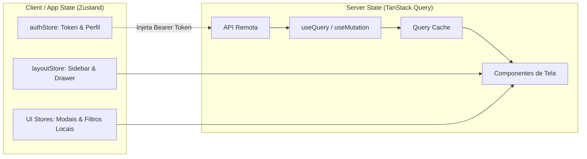

# Diretrizes e Arquitetura Frontend GoMech V2

## 1. Princípios Arquiteturais e Separação de Estados

A arquitetura do frontend GoMech V2 baseia-se em uma separação estrita entre **Server State** e **Client State**:



> [!IMPORTANT]
> **Regra de Ouro**:
> 1. **TanStack Query** é a fonte única de verdade para **Server State** (listagens, detalhes, relatórios, cadastros).
> 2. **Zustand** gerencia apenas **Client State** (sessão, tokens, preferências de layout e estado transitório de UI).
> 3. **Nunca duplique dados do servidor em stores Zustand**.

---

## 2. Estrutura de Diretórios e Limites Modulares

```
frontend/src/
├── app/                  # Configuração global (QueryClient, Router)
├── routes/               # Rotas baseadas em arquivo (@tanstack/react-router)
├── features/             # Módulos funcionais isolados
│   ├── iam/              # Usuários, filiais, papéis, autenticação
│   ├── crm/              # Clientes e veículos
│   ├── operations/       # Agendamentos, vistorias, orçamentos, OS
│   ├── inventory/        # Produtos, estoque, transferências
│   ├── tools/            # Ferramentas, custódia, calibração
│   ├── finance/          # Contas, a pagar, a receber, DRE, fluxo
│   ├── billing/          # Assinaturas, planos, faturas
│   ├── analytics/        # KPIs, relatórios, dashboards
│   └── ai/               # Gateway, copiloto, confirmação de ações
└── shared/               # Primitivas compartilhadas
    ├── api/              # Cliente Axios, interceptors, refresh queue
    ├── components/       # UI compartilhada
    │   ├── auth/         # RequirePermission, RequireRole, RequireEntitlement
    │   ├── form/         # FormField, FormLabel, FormError, TextInput, Select, SubmitButton
    │   ├── feedback/     # LoadingState, EmptyState, ErrorState, QueryStateWrapper
    │   └── layout/       # AppShell, ProtectedLayout, PublicLayout
    └── stores/           # Stores globais de cliente (layoutStore)
```

### Limites Mecânicos de Módulos (ESLint Rule)
Importações entre módulos (`features/*`) são governadas por regras de limite de módulo no `eslint.config.js`. Detalhes internos de implementação (`internal/*`, `domain/*`) são privados; apenas os pontos de entrada públicos (`api`, `types`, `components`) podem ser consumidos externamente.

---

## 3. Componentes de Formulário e Validação

Todos os formulários devem utilizar a suíte acessível em `@/shared/components/form`:

```tsx
import { useForm } from 'react-hook-form';
import { zodResolver } from '@hookform/resolvers/zod';
import { z } from 'zod';
import {
  FormField,
  FormLabel,
  FormError,
  FormDescription,
  TextInput,
  CurrencyInput,
  SubmitButton
} from '@/shared/components/form';

const schema = z.object({
  name: z.string().min(3, 'O nome deve ter no mínimo 3 caracteres'),
  price: z.number().min(0.01, 'O valor deve ser maior que zero'),
});

export function CreateServiceForm() {
  const { register, handleSubmit, formState: { errors, isSubmitting } } = useForm({
    resolver: zodResolver(schema),
  });

  return (
    <form onSubmit={handleSubmit(onSubmit)} className="space-y-4">
      <FormField error={errors.name?.message}>
        <FormLabel required>Nome do Serviço</FormLabel>
        <TextInput {...register('name')} placeholder="Ex.: Alinhamento 3D" />
        <FormError message={errors.name?.message} />
      </FormField>

      <FormField error={errors.price?.message}>
        <FormLabel required>Preço Padrão</FormLabel>
        <CurrencyInput onChange={(val) => setValue('price', val)} />
        <FormError message={errors.price?.message} />
      </FormField>

      <SubmitButton loading={isSubmitting}>
        Salvar Serviço
      </SubmitButton>
    </form>
  );
}
```

---

## 4. Padronização de Estados com `QueryStateWrapper`

Evite replicar tratamento de loading/erro manualmente em cada tela:

```tsx
import { useQuery } from '@tanstack/react-query';
import { QueryStateWrapper } from '@/shared/components/feedback';
import { operationsApi } from '@/features/operations/api';

export function QuotesListPage() {
  const { data, isLoading, isError, error, refetch } = useQuery({
    queryKey: ['operations', 'quotes'],
    queryFn: () => operationsApi.quotes().then((r) => r.data),
  });

  return (
    <QueryStateWrapper
      isLoading={isLoading}
      isError={isError}
      error={error}
      isEmpty={!data || data.length === 0}
      emptyProps={{
        title: 'Nenhum orçamento encontrado',
        description: 'Cadastre seu primeiro orçamento clicando no botão abaixo.',
        actionLabel: 'Novo Orçamento',
        onAction: () => navigate({ to: '/operations/quotes/new' }),
      }}
      loadingProps={{ variant: 'table-skeleton', count: 5 }}
      onRetry={refetch}
    >
      <QuotesTable quotes={data} />
    </QueryStateWrapper>
  );
}
```

---

## 5. Troca de Filial / Unidade e Invalidação de Cache

Ao alternar a filial ativa no `AppShell`, o `queryClient.invalidateQueries()` é disparado imediatamente para limpar e refazer queries com o novo contexto de unidade (`X-Unit-Id`), garantindo consistência total e sem vazamento de dados de cache entre oficinas.
