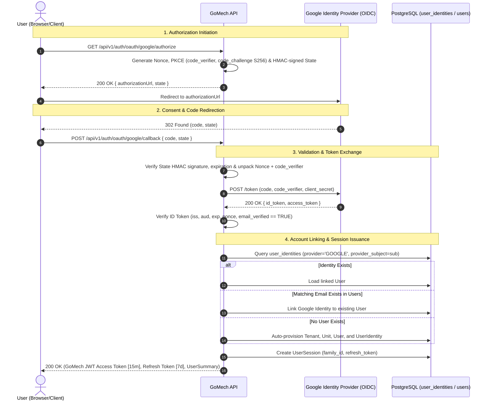

# ADR-004: Google OAuth 2.0 and OpenID Connect (OIDC) Authentication Integration

**Status:** Accepted  
**Date:** 2026-08-19  
**Deciders:** Engineering team  
**Supersedes:** None  
**Related ADRs:** [ADR-003: Tenant and Unit Isolation](file:///home/deyvid/Documents/work/gomech-project/gomech/docs/adr/ADR-003-tenant-and-unit-isolation.md), [ADR-004: REST API Conventions](file:///home/deyvid/Documents/work/gomech-project/gomech/docs/adr/ADR-004-rest-api-conventions.md), [ADR-005: JWT Access Tokens, Refresh Token Rotation, and Session Lifecycle](file:///home/deyvid/Documents/work/gomech-project/gomech/docs/adr/ADR-005-jwt-and-refresh-tokens.md)

---

## Context

GoMech V2 supports workshop owners, managers, and mechanics accessing the platform. While internal email/password authentication is supported as a first-party baseline, third-party authentication via Google OAuth 2.0 and OpenID Connect (OIDC) is required to streamline user onboarding, eliminate password fatigue, and integrate with existing Google Workspace identities.

Integrating an external identity provider introduces significant architectural and security challenges:
1. **Token Ownership & Boundary Integrity:** Provider tokens (`id_token`, Google `access_token`, Google `refresh_token`) must never serve directly as GoMech API credentials. The backend must retain total sovereignty over its token formats, tenancy boundaries, role permissions, and session revocation.
2. **Account Linking & Identity Federation:** A user may register initially via email/password and subsequently log in with Google, or vice versa. The system must safely correlate verified identities without creating duplicate accounts or allowing account takeover attacks.
3. **Anti-CSRF, Nonce, and PKCE Guarantees:** Untrusted callbacks, intercepted authorization codes, and replay attacks must be thwarted without relying on brittle, stateful server-side memory sessions in multi-instance cloud deployments.
4. **Defense in Depth (RLS):** Federated identity records (`user_identities`) must be partitioned by `tenant_id` and enforced with PostgreSQL Row-Level Security (RLS).

---

## Decision

GoMech V2 implements the **OAuth 2.0 Authorization Code Flow with PKCE and OpenID Connect (OIDC)** for Google Sign-In, issuing **only GoMech-owned JWT access tokens and rotating refresh tokens**.



---

## Technical Specifications

### 1. State, Nonce, and PKCE Cryptographic Context

To maintain stateless horizontal scaling while preventing Cross-Site Request Forgery (CSRF) and ID token replay attacks:
- **`state` Parameter:** An HMAC-SHA256 signed compact token containing:
  - `stateId`: UUID.
  - `nonce`: Cryptographically random value verified against the OIDC `id_token`.
  - `codeVerifier`: PKCE high-entropy cryptographic random string.
  - `redirectUri`: Verified callback destination.
  - `exp`: 5-minute time-to-live.
- **`code_challenge`:** SHA-256 hash of `codeVerifier`, Base64URL-encoded (`code_challenge_method=S256`).

### 2. OIDC ID Token Verification Invariants

The backend strictly enforces the following validation checks prior to trusting any claims:
1. **Issuer (`iss`):** Must match `https://accounts.google.com` or `accounts.google.com`.
2. **Audience (`aud`):** Must match the configured GoMech Google Client ID (`gomech.oauth.google.client-id`).
3. **Expiration (`exp`):** Token must not be expired (`Instant.now() < exp`).
4. **Nonce (`nonce`):** Must exactly match the nonce embedded inside the verified `state`.
5. **Email Verification (`email_verified`):** Must be strictly `true`. Unverified emails are rejected immediately to prevent pre-hijacking account takeovers.

### 3. Account Linking Policy

- **Verified Email Matching:** When an incoming Google identity has `email_verified: true`, the system queries `users` by normalized email.
  - If a user exists, a new `UserIdentity` entry is linked (`provider: 'GOOGLE'`, `provider_subject: sub`, `tenant_id: user.tenant_id`).
  - If no user exists, a new tenant organization ("Oficina <Name>"), headquarters unit, owner role, user, and `UserIdentity` are provisioned automatically.
- **Conflict Prevention:** Unique database constraints on `(provider, provider_subject)` and `(user_id, provider)` prevent identity duplication and cross-account collisions.

### 4. Row-Level Security (RLS) on Federated Identities

The `user_identities` table is created under Flyway migration `V5__Create_User_Identities_Table.sql` and protected with RLS:
```sql
ALTER TABLE user_identities ENABLE ROW LEVEL SECURITY;

CREATE POLICY tenant_isolation_policy ON user_identities
    FOR ALL
    USING (tenant_id = NULLIF(current_setting('app.current_tenant', true), '')::uuid)
    WITH CHECK (tenant_id = NULLIF(current_setting('app.current_tenant', true), '')::uuid);
```

---

## Consequences

### Positive Consequences
- **Zero Provider Token Leaks:** Third-party Google access/refresh tokens are discarded after exchange; API authorization relies exclusively on GoMech JWTs.
- **Stateless & Scalable:** Signed state and PKCE eliminate the need for server-side memory or Redis session stores during the authorization handshake.
- **Frictionless Onboarding:** Mechanics and workshop owners can authenticate instantly with existing Google credentials.
- **Idempotent Account Linking:** Existing email/password users seamlessly link their Google accounts upon their first Google login.

### Negative / Mitigated Consequences
- **Google Dependency:** Google OAuth outages temporarily impact Google sign-in; mitigated by first-party email/password authentication remaining fully operational as a fallback.
