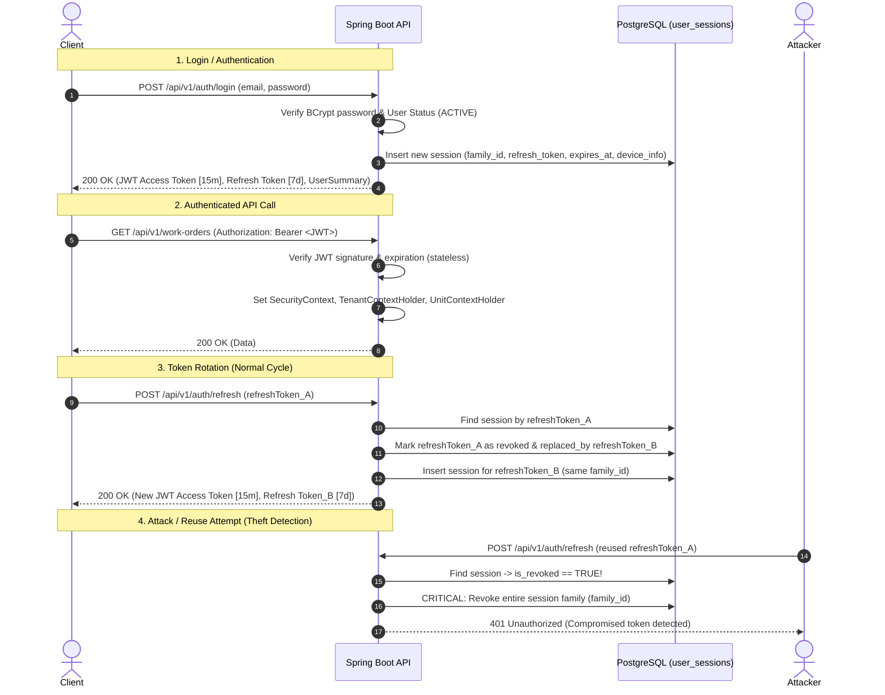

# ADR-005: JWT Access Tokens, Refresh Token Rotation, and Session Lifecycle

**Status:** Accepted  
**Date:** 2026-08-19  
**Deciders:** Engineering team  
**Supersedes:** None  
**Related ADRs:** [ADR-003: Tenant and Unit Isolation](file:///home/deyvid/Documents/work/gomech-project/gomech/docs/adr/ADR-003-tenant-and-unit-isolation.md), [ADR-004: REST API Conventions](file:///home/deyvid/Documents/work/gomech-project/gomech/docs/adr/ADR-004-rest-api-conventions.md)

---

## Context

GoMech V2 is a multi-tenant, multi-unit SaaS for automotive workshop management. Users interact with the platform across web dashboards, mobile mechanic interfaces, and integrated AI assistant tooling.

Securing API communication and managing user authentication requires resolving critical challenges:
1. **Stateless Scalability vs. Session Control:** API endpoints require fast, stateless token verification to avoid high-latency database lookups on every HTTP request. However, the system must retain absolute control over session revocation (e.g., employee termination, password changes, device theft, single logout, or logout-all).
2. **Tenant & Unit Context Injection:** Requests must carry cryptographically verified identity, tenant boundaries, active workshop branch (unit), and granular permissions without trusting caller headers or frontend storage.
3. **Protection Against Token Theft & Replay:** Storing long-lived tokens in client browsers or mobile devices creates severe risk of token exfiltration (XSS, compromised local storage, network sniffing).
4. **Third-Party Identity Independence:** External tokens (e.g., OAuth tokens from Google or billing providers) must never serve directly as internal API credentials or database session identifiers.

---

## Decision

GoMech V2 implements a **Dual-Token Authentication Architecture** combining **Short-Lived Stateless JWT Access Tokens** and **Stateful Opaque Rotating Refresh Tokens with Automatic Reuse Detection (Theft Protection)**.



---

## Access Token Design (JWT)

### 1. Token Format & Algorithms
- **Standard:** JSON Web Token (RFC 7519) signed via HMAC-SHA256 (HS256) or RS256 with 256+ bit secret keys.
- **Lifespan:** Short-lived: **15 minutes** (`jwt.expiration=900000ms`).

### 2. Claims Structure (Minimum Authority Principle)
Access tokens carry only verified identity, scope, and authorization claims. No sensitive personal data (e.g., password hashes, billing credentials) is ever embedded in the JWT:

| Claim Key | Type | Description | Example |
| :--- | :--- | :--- | :--- |
| `sub` | `String` (UUID) | Subject / User ID | `"d70656a8-c2b6-444a-a28d-1925697203b5"` |
| `tenantId` | `String` (UUID) | Tenant (Company) boundary | `"193240fb-c89d-4008-ad09-22a30b429d30"` |
| `unitId` | `String` (UUID) | Active physical branch/unit context | `"3f00a894-3992-4d89-913a-4ebfe2658826"` |
| `roles` | `List<String>` | Role names active in current unit/tenant | `["ROLE_ADMIN", "ROLE_OWNER"]` |
| `permissions`| `List<String>` | Granular permission codes for active context | `["iam:read", "workorders:write"]` |
| `jti` | `String` (UUID) | Unique JWT ID (prevents replay/allows blocklisting) | `"9b2a19b8-3e44-482a-a92e-1317d7b29a28"` |
| `iat` | `Long` (Epoch) | Issued At timestamp | `1755561600` |
| `exp` | `Long` (Epoch) | Expiration timestamp | `1755562500` |

---

## Refresh Token & Session Lifecycle

### 1. Token Properties
- **Format:** Cryptographically secure, opaque random UUID/hex string.
- **Lifespan:** Long-lived: **7 days** to **30 days** (`jwt.refresh-expiration=604800000ms`).
- **Storage:** Persisted in the `user_sessions` PostgreSQL table.

### 2. Session Entity Schema (`user_sessions`)
```sql
CREATE TABLE user_sessions (
    id UUID PRIMARY KEY DEFAULT uuid_generate_v4(),
    version BIGINT NOT NULL DEFAULT 0,
    tenant_id UUID REFERENCES tenants(id),
    user_id UUID NOT NULL REFERENCES users(id),
    family_id UUID NOT NULL DEFAULT uuid_generate_v4(),
    refresh_token VARCHAR(500) NOT NULL UNIQUE,
    replaced_by UUID REFERENCES user_sessions(id),
    is_revoked BOOLEAN NOT NULL DEFAULT FALSE,
    revoked_at TIMESTAMP WITH TIME ZONE,
    expires_at TIMESTAMP WITH TIME ZONE NOT NULL,
    last_used_at TIMESTAMP WITH TIME ZONE DEFAULT CURRENT_TIMESTAMP,
    ip_address VARCHAR(45),
    user_agent TEXT,
    device_info TEXT,
    created_at TIMESTAMP WITH TIME ZONE DEFAULT CURRENT_TIMESTAMP
);
```

### 3. Refresh Token Rotation (RTR) Mechanism
When a client requests a new access token via `POST /api/v1/auth/refresh`:
1. The backend locates the session by `refreshToken`.
2. **Reuse Detection (Theft Alert):**
   - If `is_revoked == TRUE`, the presented token has already been rotated or invalidated.
   - This signifies that either the legitimate client or an attacker is presenting a stolen, obsolete token.
   - **Remediation Action:** The backend immediately revokes **all sessions belonging to the same `family_id`** (`UPDATE user_sessions SET is_revoked=true WHERE family_id=?`), invalidating both legitimate and compromised tokens, records a security audit warning, and rejects the request with `401 Unauthorized`.
3. **Expiration Check:** If `expires_at < NOW()`, mark revoked and return `401 Unauthorized`.
4. **User Status Check:** If the user is `INACTIVE` or `SUSPENDED`, mark revoked and return `401 Unauthorized`.
5. **Atomic Rotation:**
   - Mark the current session as rotated: `is_revoked = TRUE`, `revoked_at = NOW()`.
   - Generate a fresh opaque `newRefreshToken`.
   - Insert a new session record under the **same `family_id`**, linking `oldSession.replaced_by = newSession.id`.
   - Issue a newly signed short-lived Access JWT with fresh user roles and permissions.
   - Return both tokens to the client in `AuthResponse`.

---

## Session Management & Revocation Operations

| Operation | Endpoint | Method | Security | Behavior |
| :--- | :--- | :--- | :--- | :--- |
| **Login** | `/api/v1/auth/login` | `POST` | Public | Emits JWT + Refresh Token, creates session family |
| **Register** | `/api/v1/auth/register` | `POST` | Public | Provisions Tenant, Matriz Unit, Owner User, emits tokens |
| **Refresh** | `/api/v1/auth/refresh` | `POST` | Public | Rotates Refresh Token, checks reuse, emits new JWT |
| **Logout** | `/api/v1/auth/logout` | `POST` | Public | Invalids single session/refresh token |
| **Revoke All** | `/api/v1/auth/revoke-all` | `POST` | Authenticated | Revokes all active sessions for current user |
| **Switch Unit** | `/api/v1/auth/switch-unit` | `POST` | Authenticated | Issues new JWT scoped to target `unitId` without re-login |
| **List Sessions**| `/api/v1/auth/sessions` | `GET` | Authenticated | Lists active devices/sessions with IP, User-Agent, last used |
| **Revoke One** | `/api/v1/auth/sessions/{id}` | `DELETE` | Authenticated | Revokes specific session by ID |

---

## Active Unit Switching Workflow

In multi-unit workshops, managers and technicians may have roles across several physical locations (e.g., Matriz and Filial Zona Sul).
1. When switching branches in the UI, the client calls `POST /api/v1/auth/switch-unit` with `{ "unitId": "..." }`.
2. The backend verifies that:
   - The user belongs to the same `tenantId`.
   - The user has assigned roles for `targetUnitId` (or global tenant-wide roles).
3. The backend issues a new short-lived JWT scoped to `targetUnitId` containing the specific permissions granted at that unit.
4. The client updates its in-memory access token without interrupting the user session or requiring re-entering credentials.

---

## Alternatives Considered

| Approach | Advantages | Disadvantages | Why Rejected |
| :--- | :--- | :--- | :--- |
| **Stateful Sessions Only (Cookies/Session DB on every request)** | Immediate revocation everywhere | High database read contention on every API request; hinders horizontal scaling | Fails scalability and stateless REST design goals. |
| **Long-Lived JWTs (24h+ without refresh tokens)** | Simplifies frontend token management | Compromised tokens cannot be revoked until expiry; severe security vulnerability | Unacceptable security risk for SaaS holding financial and workshop data. |
| **Redis-based Blacklisting for JWTs** | Instant JWT invalidation before natural expiry | Requires distributed cache infrastructure (Redis) to be maintained from day 1 | Unnecessary operational overhead; short 15m expiration combined with PostgreSQL session family tracking provides adequate defense. |

---

## Consequences

### Positive
- **High Performance:** Standard API calls verify JWTs purely in-memory using HS256/RS256 cryptography with zero database latency.
- **Theft Defense:** Automatic reuse detection ensures stolen refresh tokens invalidate the entire family chain upon the next refresh attempt.
- **Multi-Unit Native:** Clean separation of tenant isolation and active unit switching via JWT claims.
- **Audit & Device Management:** Users and administrators can inspect active sessions, IP addresses, and user-agents, revoking suspicious devices.

### Negative / Mitigations
- **Access Token Lifespan Window:** A revoked user retains access token validity until the 15-minute token expires.
  - *Mitigation:* Kept short (15m). Critical mutations re-check user status or database RLS policies.
- **Concurrency in Client Refresh:** Rapid simultaneous requests from the same client when a token expires could trigger false-positive reuse detection if not coordinated.
  - *Mitigation:* Frontend HTTP client (Axios interceptor) queues simultaneous 401s and performs a single refresh call with token mutex.
