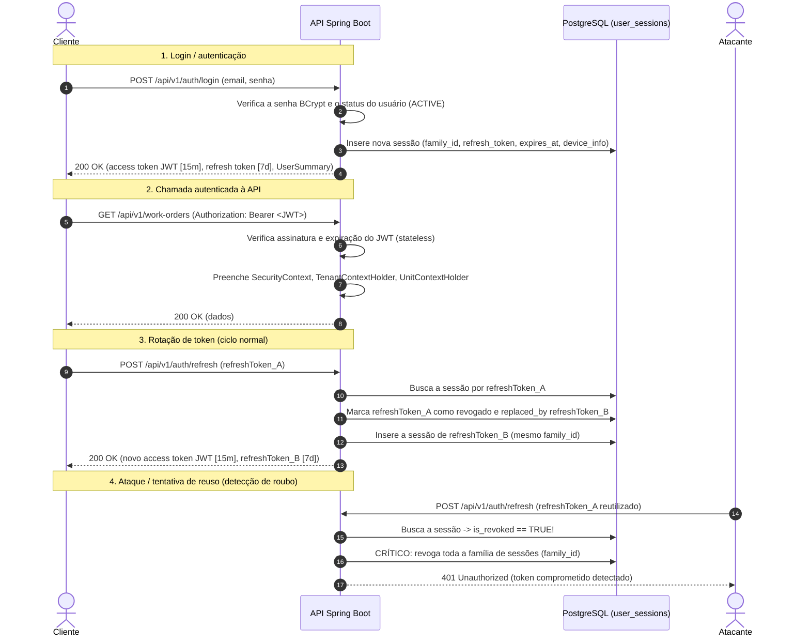

# ADR-005: Access tokens JWT, rotação de refresh tokens e ciclo de vida da sessão

- **Status:** Aceita
- **Data:** 2026-08-19
- **Relacionadas:** [ADR-014 — Isolamento de tenant e unidade](ADR-014-isolamento-de-tenant-e-unidade.md), [ADR-004 — Convenções de API REST](ADR-004-convencoes-de-api-rest.md)

## Contexto

O GoMech V2 é um SaaS multi-tenant e multiunidade para gestão de oficinas mecânicas. Os usuários interagem com a plataforma por dashboards web, interfaces mobile para mecânicos e ferramentas integradas de assistente de IA.

Proteger a comunicação com a API e gerenciar a autenticação dos usuários exige resolver desafios críticos:

1. **Escalabilidade stateless vs. controle de sessão:** os endpoints da API precisam de uma verificação de token rápida e stateless, para evitar consultas de alta latência ao banco em toda requisição HTTP. Ainda assim, o sistema precisa manter controle absoluto sobre a revogação de sessões (por exemplo: desligamento de funcionário, troca de senha, roubo de dispositivo, logout de uma sessão ou de todas).
2. **Injeção do contexto de tenant e unidade:** as requisições precisam carregar identidade verificada criptograficamente, a fronteira do tenant, a filial ativa da oficina (unidade) e permissões granulares, sem confiar em headers enviados pelo chamador nem no armazenamento do frontend.
3. **Proteção contra roubo e replay de tokens:** guardar tokens de longa duração em navegadores ou dispositivos móveis cria um risco sério de exfiltração (XSS, local storage comprometido, sniffing de rede).
4. **Independência em relação a identidades de terceiros:** tokens externos (por exemplo, tokens OAuth do Google ou de provedores de billing) nunca devem servir diretamente como credenciais internas da API nem como identificadores de sessão no banco.

## Decisão

O GoMech V2 implementa uma **arquitetura de autenticação com dois tokens**, que combina **access tokens JWT stateless de curta duração** com **refresh tokens opacos, stateful e rotativos, com detecção automática de reuso (proteção contra roubo)**.



## Design do access token (JWT)

### 1. Formato e algoritmos

- **Padrão:** JSON Web Token (RFC 7519) assinado com HMAC-SHA256 (HS256) ou RS256, com chaves secretas de 256 bits ou mais.
- **Tempo de vida:** curto, de **15 minutos** (`jwt.expiration=900000ms`).

### 2. Estrutura de claims (princípio da autoridade mínima)

Os access tokens carregam apenas claims verificadas de identidade, escopo e autorização. Nenhum dado pessoal sensível (por exemplo, hashes de senha ou credenciais de billing) é incluído no JWT:

| Claim | Tipo | Descrição | Exemplo |
| :--- | :--- | :--- | :--- |
| `sub` | `String` (UUID) | Subject / ID do usuário | `"d70656a8-c2b6-444a-a28d-1925697203b5"` |
| `tenantId` | `String` (UUID) | Fronteira do tenant (empresa) | `"193240fb-c89d-4008-ad09-22a30b429d30"` |
| `unitId` | `String` (UUID) | Contexto da filial/unidade física ativa | `"3f00a894-3992-4d89-913a-4ebfe2658826"` |
| `roles` | `List<String>` | Nomes dos papéis ativos na unidade/tenant atual | `["ROLE_ADMIN", "ROLE_OWNER"]` |
| `permissions`| `List<String>` | Códigos de permissão granulares do contexto ativo | `["iam:read", "workorders:write"]` |
| `jti` | `String` (UUID) | ID único do JWT (evita replay e permite blocklist) | `"9b2a19b8-3e44-482a-a92e-1317d7b29a28"` |
| `iat` | `Long` (epoch) | Timestamp de emissão (issued at) | `1755561600` |
| `exp` | `Long` (epoch) | Timestamp de expiração | `1755562500` |

## Refresh token e ciclo de vida da sessão

### 1. Propriedades do token

- **Formato:** string opaca e aleatória (UUID/hex), gerada de forma criptograficamente segura.
- **Tempo de vida:** longo, de **7** a **30 dias** (`jwt.refresh-expiration=604800000ms`).
- **Armazenamento:** persistido na tabela `user_sessions` do PostgreSQL.

### 2. Schema da entidade de sessão (`user_sessions`)

```sql
CREATE TABLE user_sessions (
    id UUID PRIMARY KEY DEFAULT uuid_generate_v4(),
    version BIGINT NOT NULL DEFAULT 0,
    tenant_id UUID REFERENCES tenants(id),
    user_id UUID NOT NULL REFERENCES users(id),
    family_id UUID NOT NULL DEFAULT uuid_generate_v4(),
    refresh_token VARCHAR(500) NOT NULL UNIQUE,
    replaced_by UUID REFERENCES user_sessions(id),
    is_revoked BOOLEAN NOT NULL DEFAULT FALSE,
    revoked_at TIMESTAMP WITH TIME ZONE,
    expires_at TIMESTAMP WITH TIME ZONE NOT NULL,
    last_used_at TIMESTAMP WITH TIME ZONE DEFAULT CURRENT_TIMESTAMP,
    ip_address VARCHAR(45),
    user_agent TEXT,
    device_info TEXT,
    created_at TIMESTAMP WITH TIME ZONE DEFAULT CURRENT_TIMESTAMP
);
```

### 3. Mecanismo de Refresh Token Rotation (RTR)

Quando um cliente solicita um novo access token via `POST /api/v1/auth/refresh`:

1. O backend localiza a sessão pelo `refreshToken`.
2. **Detecção de reuso (alerta de roubo):**
   - Se `is_revoked == TRUE`, o token apresentado já foi rotacionado ou invalidado.
   - Isso indica que o cliente legítimo ou um atacante está apresentando um token roubado e obsoleto.
   - **Ação de remediação:** o backend revoga imediatamente **todas as sessões do mesmo `family_id`** (`UPDATE user_sessions SET is_revoked=true WHERE family_id=?`), invalidando tanto os tokens legítimos quanto os comprometidos, registra um alerta de segurança na auditoria e rejeita a requisição com `401 Unauthorized`.
3. **Verificação de expiração:** se `expires_at < NOW()`, marca a sessão como revogada e retorna `401 Unauthorized`.
4. **Verificação de status do usuário:** se o usuário estiver `INACTIVE` ou `SUSPENDED`, marca a sessão como revogada e retorna `401 Unauthorized`.
5. **Rotação atômica:**
   - Marca a sessão atual como rotacionada: `is_revoked = TRUE`, `revoked_at = NOW()`.
   - Gera um novo `newRefreshToken` opaco.
   - Insere um novo registro de sessão sob o **mesmo `family_id`**, vinculando `oldSession.replaced_by = newSession.id`.
   - Emite um novo access JWT assinado, de curta duração, com os papéis e permissões atualizados do usuário.
   - Retorna os dois tokens ao cliente em `AuthResponse`.

## Gestão de sessões e operações de revogação

| Operação | Endpoint | Método | Acesso | Comportamento |
| :--- | :--- | :--- | :--- | :--- |
| **Login** | `/api/v1/auth/login` | `POST` | Público | Emite JWT + refresh token e cria a família de sessões |
| **Cadastro** | `/api/v1/auth/register` | `POST` | Público | Provisiona o tenant, a unidade Matriz e o usuário proprietário, e emite os tokens |
| **Refresh** | `/api/v1/auth/refresh` | `POST` | Público | Rotaciona o refresh token, verifica reuso e emite um novo JWT |
| **Logout** | `/api/v1/auth/logout` | `POST` | Público | Invalida uma única sessão/refresh token |
| **Revogar todas** | `/api/v1/auth/revoke-all` | `POST` | Autenticado | Revoga todas as sessões ativas do usuário atual |
| **Trocar unidade** | `/api/v1/auth/switch-unit` | `POST` | Autenticado | Emite um novo JWT com escopo no `unitId` de destino, sem novo login |
| **Listar sessões** | `/api/v1/auth/sessions` | `GET` | Autenticado | Lista dispositivos/sessões ativas com IP, User-Agent e último uso |
| **Revogar uma** | `/api/v1/auth/sessions/{id}` | `DELETE` | Autenticado | Revoga uma sessão específica pelo ID |

## Fluxo de troca da unidade ativa

Em oficinas com várias unidades, gerentes e técnicos podem ter papéis em diferentes locais físicos (por exemplo, Matriz e Filial Zona Sul).

1. Ao trocar de filial na UI, o cliente chama `POST /api/v1/auth/switch-unit` com `{ "unitId": "..." }`.
2. O backend verifica que:
   - O usuário pertence ao mesmo `tenantId`.
   - O usuário tem papéis atribuídos para `targetUnitId` (ou papéis globais, válidos em todo o tenant).
3. O backend emite um novo JWT de curta duração com escopo em `targetUnitId`, contendo as permissões específicas concedidas naquela unidade.
4. O cliente atualiza o access token em memória sem interromper a sessão do usuário nem exigir que as credenciais sejam digitadas de novo.

## Alternativas consideradas

| Abordagem | Vantagens | Desvantagens | Motivo da rejeição |
| :--- | :--- | :--- | :--- |
| **Apenas sessões stateful (cookies/banco de sessões consultado em toda requisição)** | Revogação imediata em qualquer lugar | Alta contenção de leitura no banco em toda requisição à API; dificulta a escalabilidade horizontal | Não atende aos objetivos de escalabilidade e de design REST stateless. |
| **JWTs de longa duração (24h ou mais, sem refresh tokens)** | Simplifica a gestão de tokens no frontend | Tokens comprometidos não podem ser revogados antes de expirar; vulnerabilidade de segurança grave | Risco de segurança inaceitável para um SaaS que guarda dados financeiros e operacionais das oficinas. |
| **Blacklist de JWTs em Redis** | Invalidação instantânea do JWT antes da expiração natural | Exige manter infraestrutura de cache distribuído (Redis) desde o primeiro dia | Overhead operacional desnecessário; a expiração curta de 15 min, combinada com o rastreamento de famílias de sessão no PostgreSQL, já oferece defesa adequada. |

## Consequências

### Positivas

- **Alto desempenho:** as chamadas comuns à API verificam o JWT inteiramente em memória, via criptografia HS256/RS256, sem latência de banco de dados.
- **Defesa contra roubo:** a detecção automática de reuso garante que um refresh token roubado invalide toda a cadeia da família na próxima tentativa de refresh.
- **Multiunidade nativo:** separação limpa entre o isolamento de tenant e a troca de unidade ativa, via claims do JWT.
- **Auditoria e gestão de dispositivos:** usuários e administradores podem inspecionar sessões ativas, endereços IP e user agents, e revogar dispositivos suspeitos.

### Negativas e mitigações

- **Janela de validade do access token:** um usuário revogado continua com o access token válido até que ele expire, em no máximo 15 minutos.
  - *Mitigação:* o tempo de vida é mantido curto (15 min). Mutações críticas verificam novamente o status do usuário ou as políticas de RLS do banco.
- **Concorrência no refresh do cliente:** várias requisições simultâneas do mesmo cliente, no momento em que o token expira, podem disparar um falso positivo na detecção de reuso se não houver coordenação.
  - *Mitigação:* o cliente HTTP do frontend (interceptor do Axios) enfileira os 401 simultâneos e faz uma única chamada de refresh, protegida por um mutex de token.
