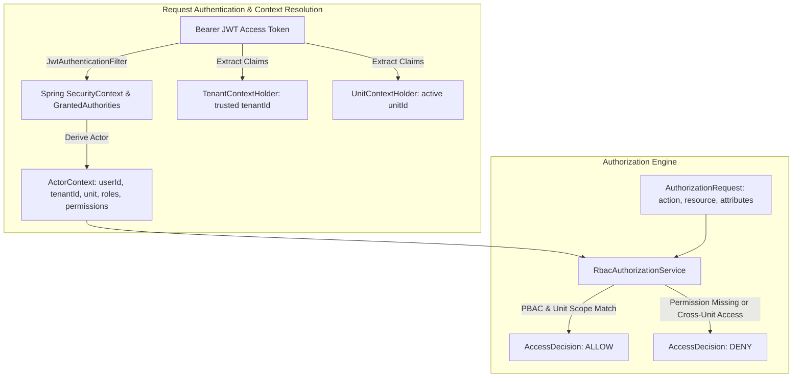

# ADR-006: Role-Based Access Control (RBAC), Permissions (PBAC), and Unit Scoping

**Status:** Accepted  
**Date:** 2026-08-19  
**Deciders:** Engineering team  
**Supersedes:** None  
**Related ADRs:** [ADR-001: Modular Monolith](file:///home/deyvid/Documents/work/gomech-project/gomech/docs/adr/ADR%20001%20%E2%80%94%20Modular%20Monolith.md), [ADR-002: Module Layering](file:///home/deyvid/Documents/work/gomech-project/gomech/docs/adr/ADR-002-module-layering-and-dependency-rules.md), [ADR-003: Tenant and Unit Isolation](file:///home/deyvid/Documents/work/gomech-project/gomech/docs/adr/ADR-003-tenant-and-unit-isolation.md), [ADR-005: JWT and Refresh Tokens](file:///home/deyvid/Documents/work/gomech-project/gomech/docs/adr/ADR-005-jwt-and-refresh-tokens.md), [ADR-012 (RLS): PostgreSQL Row Level Security](file:///home/deyvid/Documents/work/gomech-project/gomech/docs/adr/ADR-012-postgresql-rls.md)

---

## Context

GoMech V2 serves automotive workshops ranging from single-location independent shops to multi-branch operations. In this environment:
1. **Tenants** represent independent companies/workshops (strict boundary of data ownership and security).
2. **Units** represent physical workshop branches (filiais/matriz) under a single tenant.
3. **Users** can perform different roles in different units (for example, a user might be a *Gerente* at Branch A and a *Mecânico* at Branch B, or a *Proprietário* with tenant-wide administrative authority across all branches).
4. **Access Control Requirements**:
   - The authorization system must support fine-grained **Permission-Based Access Control (PBAC)** mapped into **Role-Based Access Control (RBAC)**.
   - Roles must be **data-driven** (stored in database tables `roles`, `permissions`, `role_permissions`, and `user_roles`), avoiding hardcoded Java enums so tenants can create custom roles tailored to their operations.
   - Switching the active working unit (`switch-unit`) must be seamless and must **not require re-authentication** (i.e. no re-entering passwords or re-executing OAuth flows), while cryptographically refreshing the active claims (`unitId`, `roles`, `permissions`).
   - The **Backend is the sole security boundary**; frontend UI checks are purely for user experience and never trusted for access control.

---

## Decision

GoMech V2 implements a hierarchical, data-driven **RBAC/PBAC Authorization Engine** with strict Tenant and Unit context resolution:



---

## Authorization Model and Data Schema

### 1. Data Schema Architecture
- **`permissions` (Global System Catalog):** Predefined, immutable system capabilities categorized by business module (e.g. `IAM_USER_WRITE`, `OPERATIONS_ORDER_EXECUTE`, `FINANCE_TRANSACTION_READ`).
- **`roles` (Tenant-Scoped):** Roles created per tenant, combining a set of permissions (`role_permissions`).
- **`user_roles` (Scoped Assignment):** Maps `(user_id, role_id, tenant_id, unit_id)`. When `unit_id` is `NULL`, the role applies across the entire tenant (Tenant-wide / Global). When `unit_id` is populated, the role applies exclusively to that specific workshop branch.

### 2. Seeded Default Roles
Upon tenant creation (via standard registration or Google OAuth onboarding), the system automatically provisions 4 standard roles:

| Papel (Role) | Escopo Padrão | Principais Permissões |
|---|---|---|
| **Proprietário** | Tenant-wide (`unit_id = null`) | Acesso total e irrestrito a todos os módulos (`*`). |
| **Gerente** | Unidade ou Tenant-wide | Gestão completa de CRM, Operações, Estoque, Financeiro e IAM básico de usuários e filiais. |
| **Mecânico** | Unidade | Consulta de veículos (`CRM_VEHICLE_READ`), leitura e execução técnica de ordens de serviço (`OPERATIONS_ORDER_READ`, `OPERATIONS_ORDER_EXECUTE`), consulta de estoque (`INVENTORY_PRODUCT_READ`). |
| **Atendente** | Unidade | Atendimento a clientes (`CRM_CUSTOMER_*`, `CRM_VEHICLE_*`), abertura/orçamento de ordens (`OPERATIONS_ORDER_READ`, `OPERATIONS_ORDER_WRITE`), leitura financeira. |

### 3. Active Unit Context and Switching (`POST /api/v1/auth/switch-unit`)
1. An authenticated user sends a request to switch to a target `unitId`.
2. **Isolation Validations:**
   - Validates user exists and is active.
   - Validates target unit exists and belongs to the caller's tenant (`targetUnit.getTenantId() == user.getTenantId()`). Cross-tenant switches are strictly rejected.
   - Validates user has a valid assignment for that unit (either tenant-wide role or explicit unit role).
3. **Token Re-issuance:**
   - Issues a new short-lived JWT containing the new `unitId` and the exact roles and permissions granted to that user in that unit.
   - Requires zero re-authentication.

### 4. Method Security & Programmatic Authorization
- **Spring Security `@PreAuthorize`**: Controllers and services evaluate permissions via `@PreAuthorize("hasAuthority('OPERATIONS_ORDER_EXECUTE') or hasRole('Proprietário')")`.
- **Programmatic Engine (`AuthorizationService`)**: Use cases inject `AuthorizationService` to evaluate complex context rules:
  ```java
  AccessDecision decision = authorizationService.authorize(
      actorContext,
      new AuthorizationRequest("EXECUTE", "OPERATIONS_ORDER", orderId.toString(), Map.of("unit_id", order.getUnitId().toString()))
  );
  ```

---

## Consequences

### Positive Consequences
- **Complete Scope Isolation:** Users cannot access or mutate resources outside their active unit and tenant boundaries.
- **High Operational Flexibility:** Workshop owners can create custom roles (e.g. *Consultor Técnico*, *Auditor de Garantia*) without backend code changes.
- **Fast and Frictionless UX:** Technicians and managers working across branches switch contexts instantaneously without credential friction.
- **Defense in Depth:** Combines Spring Security method security, `ActorContext` evaluation, and PostgreSQL Row-Level Security (RLS).

### Negative / Mitigated Consequences
- **Token Invalidation on Role Revocation:** Since access tokens are stateless (15 min lifespan), permission revocations take effect on the next token refresh or active unit switch; mitigated by short JWT expiration and immediate refresh token revocation (`/revoke-all`).
