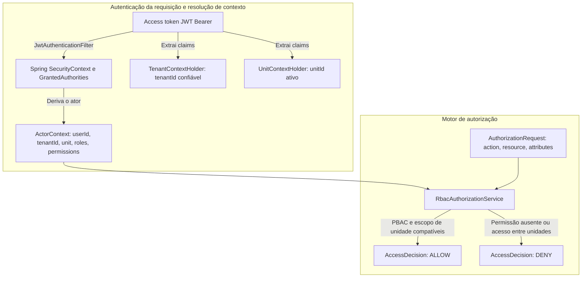

# ADR-006: Controle de acesso baseado em papéis (RBAC), permissões (PBAC) e escopo por unidade

- **Status:** Aceita
- **Data:** 2026-08-19
- **Relacionadas:** [ADR-001 — Monolito modular](ADR-001-monolito-modular.md), [ADR-002 — Camadas e regras de dependência](ADR-002-camadas-e-regras-de-dependencia.md), [ADR-014 — Isolamento de tenant e unidade](ADR-014-isolamento-de-tenant-e-unidade.md), [ADR-005 — JWT e refresh tokens](ADR-005-jwt-e-refresh-tokens.md), [ADR-017 — Row Level Security no PostgreSQL](ADR-017-row-level-security-postgresql.md)

## Contexto

O GoMech V2 atende oficinas mecânicas de todos os portes, desde oficinas independentes com um único endereço até operações com várias filiais. Nesse cenário:

1. **Tenants** representam empresas/oficinas independentes (fronteira rígida de propriedade dos dados e de segurança).
2. **Unidades** representam as filiais físicas da oficina (matriz e filiais) sob um mesmo tenant.
3. **Usuários** podem exercer papéis diferentes em unidades diferentes (por exemplo, um usuário pode ser *Gerente* na Filial A e *Mecânico* na Filial B, ou *Proprietário* com autoridade administrativa sobre todo o tenant, em todas as filiais).
4. **Requisitos de controle de acesso:**
   - O sistema de autorização precisa suportar **controle de acesso baseado em permissões (PBAC)** granular, mapeado em **controle de acesso baseado em papéis (RBAC)**.
   - Os papéis devem ser **orientados a dados** (armazenados nas tabelas `roles`, `permissions`, `role_permissions` e `user_roles`), evitando enums Java hardcoded, para que os tenants possam criar papéis customizados para a própria operação.
   - A troca da unidade de trabalho ativa (`switch-unit`) precisa ser transparente e **não pode exigir nova autenticação** (ou seja, sem digitar a senha de novo nem refazer fluxos OAuth), mas deve renovar criptograficamente as claims ativas (`unitId`, `roles`, `permissions`).
   - O **backend é a única fronteira de segurança**; as verificações na UI do frontend servem apenas à experiência do usuário e nunca são consideradas confiáveis para controle de acesso.

## Decisão

O GoMech V2 implementa um **motor de autorização RBAC/PBAC** hierárquico e orientado a dados, com resolução rígida do contexto de tenant e de unidade:



## Modelo de autorização e schema de dados

### 1. Estrutura do schema de dados

- **`permissions` (catálogo global do sistema):** capacidades do sistema predefinidas e imutáveis, agrupadas por módulo de negócio (por exemplo, `IAM_USER_WRITE`, `OPERATIONS_ORDER_EXECUTE`, `FINANCE_TRANSACTION_READ`).
- **`roles` (escopo de tenant):** papéis criados por tenant, cada um combinando um conjunto de permissões (`role_permissions`).
- **`user_roles` (atribuição com escopo):** mapeia `(user_id, role_id, tenant_id, unit_id)`. Quando `unit_id` é `NULL`, o papel vale para todo o tenant (global no tenant). Quando `unit_id` está preenchido, o papel vale exclusivamente para aquela filial.

### 2. Papéis padrão criados no seed

Na criação do tenant (via cadastro padrão ou onboarding com Google OAuth), o sistema provisiona automaticamente 4 papéis padrão:

| Papel | Escopo padrão | Principais permissões |
|---|---|---|
| **Proprietário** | Todo o tenant (`unit_id = null`) | Acesso total e irrestrito a todos os módulos (`*`). |
| **Gerente** | Unidade ou todo o tenant | Gestão completa de CRM, Operações, Estoque, Financeiro e IAM básico de usuários e filiais. |
| **Mecânico** | Unidade | Consulta de veículos (`CRM_VEHICLE_READ`), leitura e execução técnica de ordens de serviço (`OPERATIONS_ORDER_READ`, `OPERATIONS_ORDER_EXECUTE`), consulta de estoque (`INVENTORY_PRODUCT_READ`). |
| **Atendente** | Unidade | Atendimento a clientes (`CRM_CUSTOMER_*`, `CRM_VEHICLE_*`), abertura/orçamento de ordens (`OPERATIONS_ORDER_READ`, `OPERATIONS_ORDER_WRITE`), leitura financeira. |

### 3. Contexto de unidade ativa e troca de unidade (`POST /api/v1/auth/switch-unit`)

1. Um usuário autenticado envia uma requisição para trocar para um `unitId` de destino.
2. **Validações de isolamento:**
   - Valida que o usuário existe e está ativo.
   - Valida que a unidade de destino existe e pertence ao tenant de quem chama (`targetUnit.getTenantId() == user.getTenantId()`). Trocas entre tenants são sempre rejeitadas.
   - Valida que o usuário tem uma atribuição válida para aquela unidade (papel válido em todo o tenant ou papel explícito da unidade).
3. **Reemissão do token:**
   - Emite um novo JWT de curta duração contendo o novo `unitId` e exatamente os papéis e permissões concedidos a esse usuário naquela unidade.
   - Não exige nenhuma nova autenticação.

### 4. Method security e autorização programática

- **`@PreAuthorize` do Spring Security:** controllers e serviços avaliam permissões via `@PreAuthorize("hasAuthority('OPERATIONS_ORDER_EXECUTE') or hasRole('Proprietário')")`.
- **Motor programático (`AuthorizationService`):** os casos de uso injetam o `AuthorizationService` para avaliar regras de contexto complexas:
  ```java
  AccessDecision decision = authorizationService.authorize(
      actorContext,
      new AuthorizationRequest("EXECUTE", "OPERATIONS_ORDER", orderId.toString(), Map.of("unit_id", order.getUnitId().toString()))
  );
  ```

## Consequências

### Positivas

- **Isolamento completo de escopo:** usuários não conseguem acessar nem alterar recursos fora dos limites da unidade ativa e do tenant.
- **Alta flexibilidade operacional:** donos de oficina podem criar papéis customizados (por exemplo, *Consultor Técnico*, *Auditor de Garantia*) sem mudanças no código do backend.
- **UX rápida e sem atrito:** técnicos e gerentes que trabalham em várias filiais trocam de contexto instantaneamente, sem precisar digitar credenciais.
- **Defesa em profundidade:** combina a method security do Spring Security, a avaliação do `ActorContext` e o Row-Level Security (RLS) do PostgreSQL.

### Negativas e mitigações

- **Invalidação de token na revogação de papéis:** como os access tokens são stateless (vida útil de 15 min), revogações de permissão só têm efeito no próximo refresh do token ou na próxima troca de unidade ativa. Isso é mitigado pela expiração curta do JWT e pela revogação imediata dos refresh tokens (`/revoke-all`).
