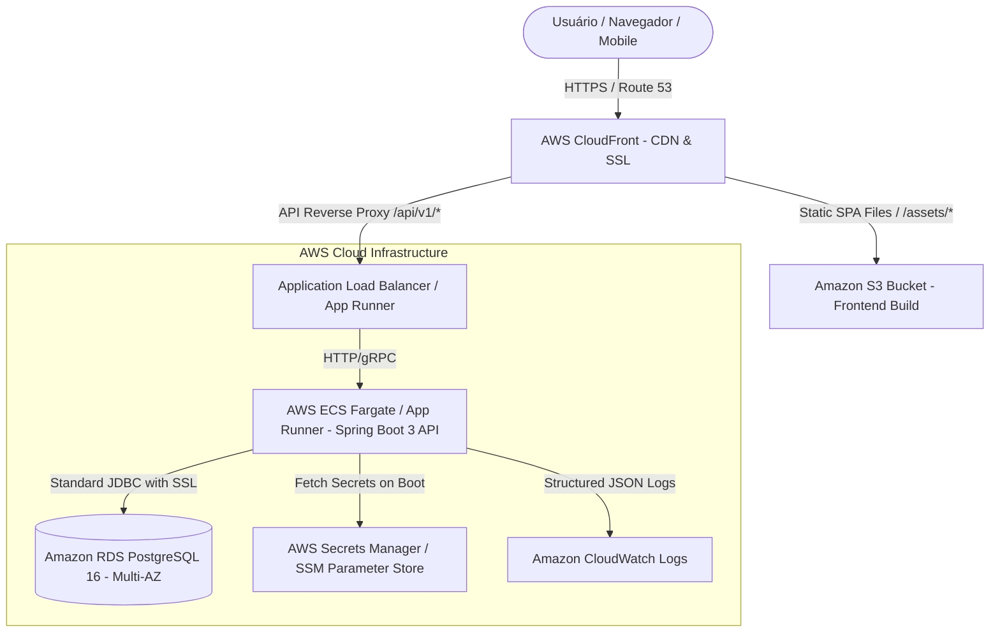

# ADR-013: AWS Cloud Infrastructure, Database Persistence, and Deployment Strategy

**Status:** Accepted  
**Date:** 2026-08-19  
**Deciders:** Engineering team  
**Supersedes:** None  
**Related ADRs:** [ADR-001: Modular Monolith](file:///home/deyvid/Documents/work/gomech-project/gomech/docs/adr/ADR%20001%20%E2%80%94%20Modular%20Monolith.md), [ADR-003: Tenant and Unit Isolation](file:///home/deyvid/Documents/work/gomech-project/gomech/docs/adr/ADR-003-tenant-and-unit-isolation.md), [ADR-012: PostgreSQL Migration Baseline and Persistence Conventions](file:///home/deyvid/Documents/work/gomech-project/gomech/docs/adr/ADR-012-postgresql-migration-baseline.md), [ADR-012 (RLS): PostgreSQL Row Level Security (RLS) as Defense in Depth](file:///home/deyvid/Documents/work/gomech-project/gomech/docs/adr/ADR-012-postgresql-rls.md)

---

## Context

GoMech V2 is a multi-tenant, multi-unit SaaS for automotive workshop management requiring high availability, strong database security (PostgreSQL Row-Level Security), automated continuous deployment, and low operational friction.

During initial technical evaluations, Google Cloud Platform (GCP - Cloud Run e Cloud SQL) was considered as an alternative. However, the operational baseline and infrastructure roadmap required a cloud provider with broader enterprise tooling, mature relational database management, cost-effective container execution, and robust CDN/edge delivery for Single Page Applications (SPAs).

Critical deployment challenges include:
1. **Cloud-Agnostic Application Core:** The application codebase (Spring Boot 3 / Java 21) must remain strictly independent of proprietary cloud SDKs and socket factories, enabling standard JDBC connections with SSL/TLS encryption.
2. **Database Management & Row-Level Security:** The database layer requires managed PostgreSQL 16+ with native support for Row-Level Security (RLS), automated backups, connection pooling, and Multi-AZ replication.
3. **Container Orchestration & Auto-scaling:** The backend modular monolith container must scale horizontally based on CPU/memory load without maintaining virtual machine fleets manually.
4. **Static Asset Distribution:** The frontend (React/Vite) must be delivered with ultra-low latency, HTTPS certificates, and global edge caching.
5. **Secret Management:** Sensitive credentials (JWT secret, OAuth secrets, database passwords) must be securely injected via environment variables without committing them to source control.

---

## Decision

GoMech V2 adopts **Amazon Web Services (AWS)** as the official cloud infrastructure provider for production and staging deployments, utilizing managed serverless container and database services.



---

## Technical Specifications

### 1. Database Tier: Amazon RDS for PostgreSQL 16
- **Service:** Amazon RDS (Relational Database Service) for PostgreSQL 16.
- **Connection Configuration:** Standard JDBC with SSL enabled (`sslmode=require`), managed through the `prod` profile in `application-prod.yml`:
  ```yaml
  spring:
    datasource:
      url: jdbc:postgresql://${DB_HOST}:${DB_PORT:5432}/${DB_NAME:gomech_prod}?sslmode=${DB_SSL_MODE:require}
      username: ${DB_USER}
      password: ${DB_PASSWORD}
      driver-class-name: org.postgresql.Driver
      hikari:
        maximum-pool-size: 20
        minimum-idle: 5
        idle-timeout: 300000
        max-lifetime: 1200000
  ```
- **Security & Tenancy:** Full compatibility with PostgreSQL Row-Level Security (RLS) policies (`V3__Enable_Tenant_And_Unit_Row_Level_Security.sql` e `V5__Create_User_Identities_Table.sql`).
- **High Availability:** Multi-AZ deployment for automated failover in production.

### 2. Backend Tier: AWS ECS (Fargate) / AWS App Runner
- **Packaging:** Multi-stage Docker container based on Eclipse Temurin / Amazon Corretto 21 JRE.
- **Runtime:** Serverless container execution (AWS Fargate ou AWS App Runner), eliminating EC2 instance maintenance.
- **Observability:** Health check probes mapped to `/actuator/health` with automatic container replacement on failure.
- **Logging:** Structured logging output with `correlation_id` integration streamed to Amazon CloudWatch.

### 3. Frontend Tier: Amazon S3 + AWS CloudFront
- **Storage:** Amazon S3 bucket configured for static website hosting (SPA mode, fallback to `index.html`).
- **Edge Caching:** AWS CloudFront distribution delivering gzip/brotli compression, global low-latency edge caches, and SSL termination via AWS Certificate Manager (ACM).

### 4. Secrets and Configuration
- **Parameter Injection:** Production secrets (`DB_PASSWORD`, `JWT_SECRET`, `GOOGLE_CLIENT_SECRET`) are stored in **AWS Secrets Manager** or **AWS Systems Manager (SSM) Parameter Store** and injected into container environments at startup.
- **Zero Cloud SDK Lock-in:** The backend consumes standard environment variables, avoiding proprietary AWS client libraries in the core application codebase.

---

## Consequences

### Positive Consequences
- **Cloud Independence:** Removal of proprietary GCP socket factory dependencies keeps the Java codebase 100% cloud-agnostic and testable with standard Testcontainers.
- **Scalability & Reliability:** Managed Multi-AZ RDS and serverless Fargate containers ensure 99.95%+ uptime without infrastructure overhead.
- **Low Operational Cost:** Static frontend hosting on S3/CloudFront reduces compute costs to near-zero for asset delivery.
- **Enterprise-Grade Security:** Native support for VPC peering, RDS IAM authentication, SSL encryption in transit, and KMS encryption at rest.

### Negative / Mitigated Consequences
- **AWS Configuration Complexity:** AWS IAM roles and VPC subnets require structured Terraform/IaC templates; mitigated by containerized workflows and environment variable isolation.
