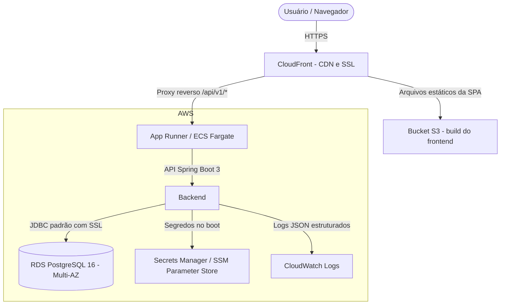

# ADR-013: Infraestrutura na AWS, persistência e estratégia de deploy

- **Status:** Substituída pela [ADR-020](ADR-020-terraform-multicloud-e-gcp.md)
- **Data:** 2026-08-19
- **Relacionadas:** [ADR-001 — Monolito modular](ADR-001-monolito-modular.md), [ADR-012 — Baseline de migrations](ADR-012-baseline-de-migrations-postgresql.md), [ADR-014 — Isolamento de tenant e unidade](ADR-014-isolamento-de-tenant-e-unidade.md), [ADR-017 — Row Level Security](ADR-017-row-level-security-postgresql.md)

> Esta ADR registra o plano original de rodar o GoMech na AWS. Ele foi revisto: a infraestrutura passou a ser descrita em Terraform para AWS **e** GCP, e a GCP virou o ambiente de execução ([ADR-020](ADR-020-terraform-multicloud-e-gcp.md)). Os requisitos listados aqui continuam válidos e orientaram as duas implementações.

## Contexto

O GoMech V2 é um SaaS multi-tenant e multiunidade para gestão de oficinas. Ele precisa de alta disponibilidade, segurança forte no banco (Row Level Security no PostgreSQL), deploy automatizado e pouca fricção operacional.

Nas primeiras avaliações, a GCP (Cloud Run e Cloud SQL) foi considerada como alternativa. Naquele momento, a AWS pareceu mais adequada por oferecer ferramentas corporativas mais amplas, banco relacional gerenciado maduro, execução de containers com bom custo e CDN robusta para Single Page Applications.

Os principais desafios do deploy eram:

1. **Núcleo da aplicação agnóstico de nuvem:** o código (Spring Boot 3 / Java 21) não pode depender de SDKs proprietários nem de *socket factories* do provedor. A conexão com o banco deve ser JDBC padrão com SSL/TLS.
2. **Banco gerenciado com RLS:** PostgreSQL 16+ gerenciado, com suporte nativo a Row Level Security, backups automáticos, pool de conexões e replicação Multi-AZ.
3. **Containers com auto-scaling:** o monolito modular precisa escalar horizontalmente por CPU e memória, sem administrar frotas de máquinas virtuais.
4. **Distribuição dos assets estáticos:** o frontend (React/Vite) precisa ser entregue com baixa latência, HTTPS e cache global de borda.
5. **Gestão de segredos:** credenciais sensíveis (chave JWT, segredos de OAuth, senha do banco) devem ser injetadas por variáveis de ambiente, nunca versionadas.

## Decisão

Adotar a **Amazon Web Services (AWS)** como provedor oficial de produção e staging, com serviços gerenciados de containers serverless e de banco de dados.



## Especificação técnica

### 1. Banco de dados: Amazon RDS for PostgreSQL 16

- **Conexão:** JDBC padrão com SSL (`sslmode=require`), configurada no profile `prod` (`application-prod.yml`):
  ```yaml
  spring:
    datasource:
      url: jdbc:postgresql://${DB_HOST}:${DB_PORT:5432}/${DB_NAME:gomech_prod}?sslmode=${DB_SSL_MODE:require}
      username: ${DB_USER}
      password: ${DB_PASSWORD}
      driver-class-name: org.postgresql.Driver
      hikari:
        maximum-pool-size: 20
        minimum-idle: 5
        idle-timeout: 300000
        max-lifetime: 1200000
  ```
- **Segurança e tenancy:** compatibilidade total com as policies de RLS (`V3__Enable_Tenant_And_Unit_Row_Level_Security.sql` e `V5__Create_User_Identities_Table.sql`).
- **Alta disponibilidade:** Multi-AZ com failover automático em produção.

### 2. Backend: AWS App Runner / ECS Fargate

- **Empacotamento:** container Docker multi-stage com JRE Eclipse Temurin 21.
- **Execução:** containers serverless, sem manutenção de instâncias EC2.
- **Observabilidade:** health check em `/actuator/health`, com substituição automática do container em caso de falha.
- **Logs:** saída estruturada com `correlation_id`, enviada ao CloudWatch.

### 3. Frontend: Amazon S3 + CloudFront

- **Armazenamento:** bucket S3 com fallback de SPA para `index.html`.
- **Borda:** distribuição CloudFront com compressão, cache global e terminação SSL.

### 4. Segredos e configuração

- **Injeção:** segredos de produção (`DB_PASSWORD`, `JWT_SECRET`, `GOOGLE_CLIENT_SECRET`) ficam no Secrets Manager ou no SSM Parameter Store e são injetados no container no boot.
- **Sem lock-in de SDK:** o backend só lê variáveis de ambiente padrão, sem bibliotecas proprietárias da AWS.

## Consequências

### Positivas

- **Independência de nuvem:** sem *socket factory* proprietária, o código Java continua agnóstico e testável com Testcontainers.
- **Escalabilidade e confiabilidade:** RDS Multi-AZ e containers serverless, sem sobrecarga de infraestrutura.
- **Custo baixo de entrega:** hospedar o frontend em S3/CloudFront reduz o custo de computação dos assets a quase zero.
- **Segurança:** SSL em trânsito e criptografia em repouso.

### Negativas e mitigações

- **Complexidade de configuração:** IAM e rede exigem templates de IaC estruturados. A mitigação é o módulo Terraform em [`terraform/modules/aws`](../../terraform/modules/aws).
