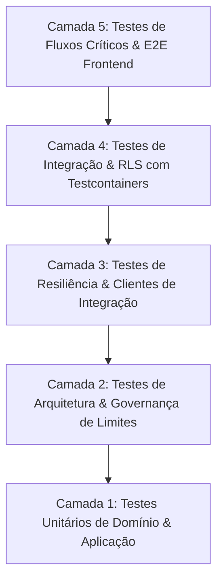

# ADR-015: Estratégia de testes automatizados em camadas

- **Status:** Aceita

## Contexto

O GoMech V2 é um monolito modular multi-tenant de missão crítica para a gestão de oficinas automotivas, que opera sob fortes restrições arquiteturais:

1. **Isolamento multi-tenant estrito:** nenhuma query de negócio pode ignorar o `tenant_id` ou violar o Row Level Security (RLS) do PostgreSQL.
2. **Modularidade e fronteiras estritas:** os módulos do backend se comunicam exclusivamente por contratos públicos em pacotes `api/` ou por eventos de domínio no `EventBus` ([ADR-002](ADR-002-camadas-e-regras-de-dependencia.md)).
3. **IA sem autonomia (human-in-the-loop):** ações de IA nunca alteram o banco de forma autônoma; dependem de confirmação explícita com TTL e de roteamento por comandos de domínio.
4. **Resiliência e idempotência:** o consumo de eventos, as mutações financeiras e as integrações externas (serviço de IA em FastAPI, Pagar.me) não podem duplicar efeitos colaterais.

Para garantir que essas invariantes continuem válidas durante o desenvolvimento contínuo e as refatorações, é necessária uma estratégia de testes automatizados em camadas, que defina escopos, responsabilidades, ferramentas e critérios de aceitação no CI.

## Decisão

Adotamos a **pirâmide de testes automatizados em camadas**, estruturada da base ao topo:

### 1. Camada 1: testes unitários de domínio e aplicação

- **Escopo:** lógica de negócio pura, entidades de domínio, cálculos de orçamento, baixas de estoque, regras de máquina de estados (ex.: `WorkOrderStatus`, `AiActionProposalStatus`), sanitização de dados sensíveis e mapeamento de DTOs.
- **Ferramentas:** JUnit 5, AssertJ, Mockito.
- **Premissa:** execução 100% em memória e muito rápida (menos de 15 segundos para toda a suíte), sem subir o Spring Context nem fazer I/O de rede.

### 2. Camada 2: testes de regras de arquitetura (ArchUnit e ESLint)

- **Escopo:**
  - **Backend (ArchUnit):** o `ModuleArchitectureRulesTest` valida que classes internas de um módulo não são acessadas por outros módulos, que os contratos ficam exclusivamente em `api/`, que os eventos estendem `DomainEvent` e que a injeção de repositórios de outros módulos é bloqueada em tempo de build.
  - **Frontend (ESLint `no-restricted-imports`):** bloqueia importações privadas entre features (`@/features/*/internal/*`), garantindo o uso das interfaces públicas.

### 3. Camada 3: testes de resiliência e de clientes de integração

- **Escopo:** resiliência a falhas de rede, timeouts, rate limits e fallback gracioso:
  - `AiServiceClientResilienceTest`: valida retentativas com exponential backoff e jitter, circuit breaker e conversão de status HTTP.
  - `DomainEventBusDispatchTest`: idempotência do despacho e tratamento de erros nos consumers.

### 4. Camada 4: testes de integração de dados com PostgreSQL real e RLS (Testcontainers)

- **Escopo:** verificação física das migrations Flyway (`V1` até `V20`) e das políticas de Row Level Security (`tenant_isolation_policy`):
  - Testes com um contêiner real `postgres:16-alpine`, gerenciado pelo Testcontainers.
  - Validação de que queries autenticadas com `SET LOCAL app.current_tenant = '...'` nunca retornam dados de outros tenants ou de unidades não autorizadas.

### 5. Camada 5: testes de componentes e fluxos críticos no frontend

- **Escopo:**
  - Validação acessível de formulários (`FormField`, `FormLabel`, `FormError`, `SubmitButton`).
  - Renderização consistente dos estados de visualização (`LoadingState`, `EmptyState`, `ErrorState`, `QueryStateWrapper`).
  - Fila concorrente de renovação de tokens JWT (fila de refresh em respostas 401) e troca dinâmica de unidade (`useLayoutStore` + `switchActiveUnit`).
  - Fluxo de confirmação e rejeição de ações de IA (`AiActionConfirmationModal`).

## Matriz de cobertura e responsabilidade

| Camada de teste | Alvo / invariante validada | Ferramenta | Tempo típico | Execução no CI |
|---|---|---|---|---|
| **Unitário** | Lógica de cálculo, transições de estado, validação | JUnit 5 + Mockito | < 10s | A cada commit / PR |
| **Arquitetura** | Fronteiras modulares da ADR-002, desacoplamento | ArchUnit + ESLint | < 5s | A cada commit / PR |
| **Resiliência** | Retentativas, backoff, idempotência de eventos | JUnit 5 + Mockito | < 2s | A cada commit / PR |
| **Integração RLS** | Isolamento físico multi-tenant, migrations Flyway | Testcontainers + Postgres | < 30s | Em PRs e merges |
| **Frontend** | Validação de formulários, estados, refresh de autenticação | TypeScript + Vite/ESLint | < 5s | A cada commit / PR |

## Consequências

### Positivas

- **Zero regressão nas fronteiras arquiteturais:** mudanças de código que quebram fronteiras modulares ou regras de RLS são rejeitadas imediatamente, no build local e no pipeline de CI.
- **Velocidade de feedback:** mais de 90% dos testes executam em menos de 15 segundos, o que preserva a produtividade no desenvolvimento.
- **Confiabilidade multi-tenant:** o Testcontainers garante paridade exata com o comportamento do PostgreSQL em produção.

### Negativas / custos

- Os testes de integração com Testcontainers exigem um ambiente com Docker disponível.
