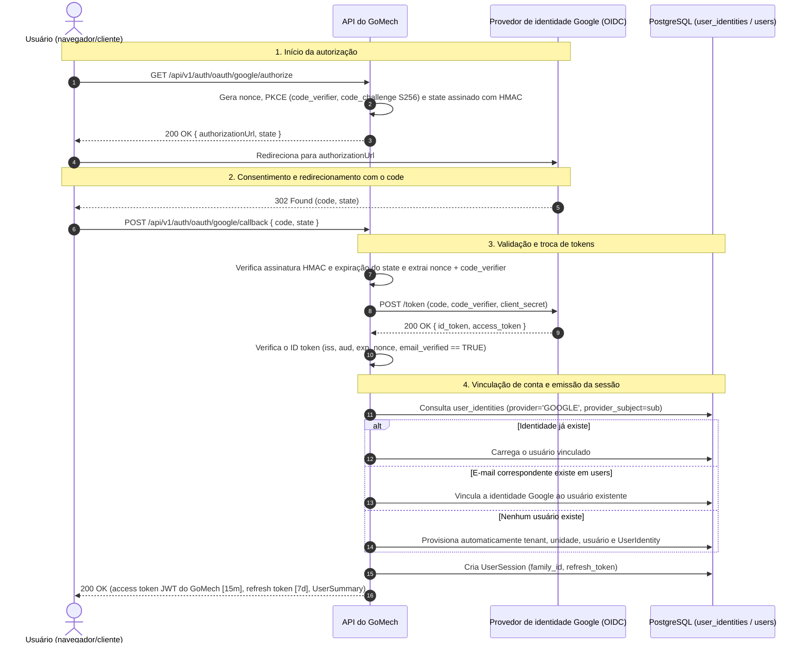

# ADR-016: Autenticação com Google via OAuth 2.0 e OpenID Connect (OIDC)

- **Status:** Aceita
- **Data:** 2026-08-19
- **Relacionadas:** [ADR-004 — Convenções de API REST](ADR-004-convencoes-de-api-rest.md), [ADR-005 — JWT e refresh tokens](ADR-005-jwt-e-refresh-tokens.md), [ADR-014 — Isolamento de tenant e unidade](ADR-014-isolamento-de-tenant-e-unidade.md)

> Numeração anterior: ADR-004 (renumerada para eliminar números duplicados).

## Contexto

O GoMech V2 atende donos de oficina, gerentes e mecânicos que acessam a plataforma. Embora a autenticação própria com e-mail/senha seja suportada como base (first-party), a autenticação de terceiros via Google OAuth 2.0 e OpenID Connect (OIDC) é necessária para simplificar o onboarding de usuários, eliminar a fadiga de senhas e integrar com identidades já existentes no Google Workspace.

Integrar um provedor de identidade externo traz desafios relevantes de arquitetura e segurança:

1. **Posse dos tokens e integridade das fronteiras:** os tokens do provedor (`id_token`, `access_token` do Google, `refresh_token` do Google) nunca devem servir diretamente como credenciais da API do GoMech. O backend precisa manter total soberania sobre os formatos de token, as fronteiras de tenancy, as permissões dos papéis e a revogação de sessões.
2. **Vinculação de contas e federação de identidade:** um usuário pode se cadastrar primeiro com e-mail/senha e depois entrar com Google, ou vice-versa. O sistema precisa correlacionar identidades verificadas com segurança, sem criar contas duplicadas nem permitir ataques de account takeover.
3. **Garantias anti-CSRF, de nonce e de PKCE:** callbacks não confiáveis, authorization codes interceptados e ataques de replay precisam ser bloqueados sem depender de sessões frágeis, com estado guardado na memória do servidor, em deploys de nuvem com múltiplas instâncias.
4. **Defesa em profundidade (RLS):** os registros de identidade federada (`user_identities`) precisam ser particionados por `tenant_id` e protegidos com Row Level Security (RLS) do PostgreSQL.

## Decisão

O GoMech V2 implementa o **fluxo Authorization Code do OAuth 2.0 com PKCE e OpenID Connect (OIDC)** para o login com Google, emitindo **apenas access tokens JWT próprios do GoMech e refresh tokens com rotação**.



## Especificações técnicas

### 1. Contexto criptográfico de state, nonce e PKCE

Para manter a escalabilidade horizontal stateless e, ao mesmo tempo, impedir Cross-Site Request Forgery (CSRF) e ataques de replay do ID token:

- **Parâmetro `state`:** um token compacto assinado com HMAC-SHA256, contendo:
  - `stateId`: UUID.
  - `nonce`: valor criptograficamente aleatório, verificado contra o `id_token` do OIDC.
  - `codeVerifier`: string aleatória de alta entropia do PKCE.
  - `redirectUri`: destino de callback verificado.
  - `exp`: time-to-live de 5 minutos.
- **`code_challenge`:** hash SHA-256 do `codeVerifier`, codificado em Base64URL (`code_challenge_method=S256`).

### 2. Invariantes de verificação do ID token OIDC

O backend aplica estritamente as seguintes validações antes de confiar em qualquer claim:

1. **Emissor (`iss`):** deve ser `https://accounts.google.com` ou `accounts.google.com`.
2. **Audiência (`aud`):** deve corresponder ao Google Client ID configurado no GoMech (`gomech.oauth.google.client-id`).
3. **Expiração (`exp`):** o token não pode estar expirado (`Instant.now() < exp`).
4. **Nonce (`nonce`):** deve ser exatamente igual ao nonce embutido no `state` verificado.
5. **Verificação de e-mail (`email_verified`):** deve ser estritamente `true`. E-mails não verificados são rejeitados imediatamente, para evitar account takeover por pre-hijacking.

### 3. Política de vinculação de contas

- **Correspondência por e-mail verificado:** quando uma identidade Google recebida tem `email_verified: true`, o sistema consulta `users` pelo e-mail normalizado.
  - Se o usuário existir, uma nova entrada `UserIdentity` é vinculada a ele (`provider: 'GOOGLE'`, `provider_subject: sub`, `tenant_id: user.tenant_id`).
  - Se não existir, são provisionados automaticamente uma nova organização tenant ("Oficina <Nome>"), a unidade matriz, o papel de proprietário, o usuário e a `UserIdentity`.
- **Prevenção de conflitos:** constraints únicas no banco em `(provider, provider_subject)` e `(user_id, provider)` impedem a duplicação de identidades e colisões entre contas.

### 4. Row Level Security (RLS) nas identidades federadas

A tabela `user_identities` é criada pela migration Flyway [`V5__Create_User_Identities_Table.sql`](https://github.com/DeyvidJesus/gomech-backend-v2/blob/master/src/main/resources/db/migration/V5__Create_User_Identities_Table.sql) e protegida com RLS:

```sql
ALTER TABLE user_identities ENABLE ROW LEVEL SECURITY;

CREATE POLICY tenant_isolation_policy ON user_identities
    FOR ALL
    USING (tenant_id = NULLIF(current_setting('app.current_tenant', true), '')::uuid)
    WITH CHECK (tenant_id = NULLIF(current_setting('app.current_tenant', true), '')::uuid);
```

## Consequências

### Positivas

- **Zero vazamento de tokens do provedor:** os access e refresh tokens do Google são descartados após a troca; a autorização na API depende exclusivamente dos JWTs do GoMech.
- **Stateless e escalável:** o state assinado e o PKCE eliminam a necessidade de memória no servidor ou de um session store em Redis durante o handshake de autorização.
- **Onboarding sem atrito:** mecânicos e donos de oficina podem se autenticar na hora com as credenciais Google que já têm.
- **Vinculação de contas idempotente:** usuários existentes de e-mail/senha vinculam a conta Google de forma transparente no primeiro login com Google.

### Negativas / mitigadas

- **Dependência do Google:** indisponibilidades do Google OAuth afetam temporariamente o login com Google; o impacto é mitigado pela autenticação própria com e-mail/senha, que continua totalmente operacional como fallback.
