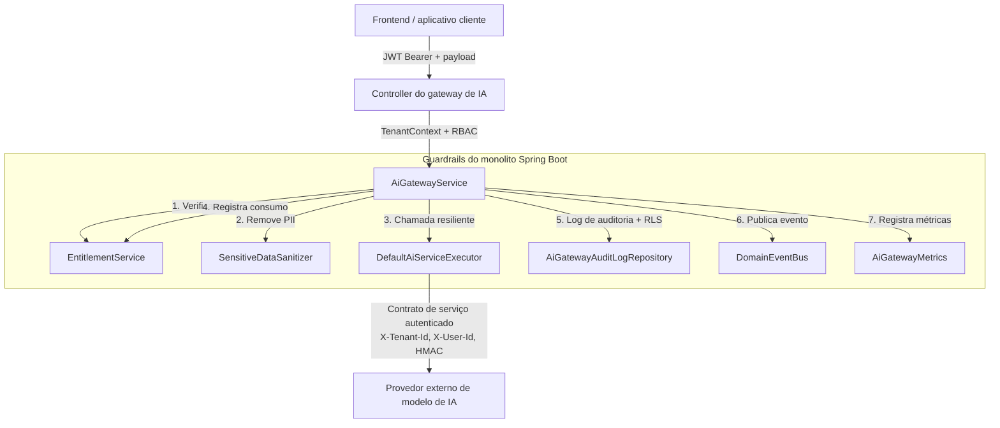

# ADR-018: Gateway de IA seguro hospedado no monolito

- **Status:** Aceita

> Numeração anterior: ADR-010 (renumerada para eliminar números duplicados).

## Contexto

As oficinas e os centros automotivos que usam o GoMech precisam de recursos de IA generativa e de raciocínio, como assistência ao diagnóstico a partir da descrição de sintomas e de códigos de falha OBD, geração automática de itens de orçamento (mão de obra e peças), resumos técnicos de ordens de serviço e rascunhos de mensagens para clientes.

No entanto, dar às aplicações cliente ou às interfaces de frontend acesso direto a provedores externos de IA (como OpenAI, Anthropic, Gemini ou Vertex AI), ou permitir que serviços remotos de IA acessem diretamente o banco do GoMech, introduz riscos críticos:

1. **Quebra de multi-tenancy e de isolamento de dados:** prompts poderiam vazar dados pessoais sensíveis (PII) de clientes (CPF, telefones, e-mails, endereços) ou dados de outros tenants.
2. **Bypass de autorização e dos entitlements do plano:** clientes poderiam chamar modelos externos diretamente, sem autenticação de tenant, sem verificação de permissões RBAC (`AI_QUERY`, `AI_ACTION_EXECUTE`, `AI_ADMIN`) e sem os limites de cota do billing (`QuotaDimension.AI_USAGE`, `MODULE_AI`).
3. **Falta de auditabilidade e de observabilidade:** seria impossível rastrear qual usuário, tenant e unidade solicitou uma completion do modelo, qual volume de tokens foi consumido e quais propostas foram geradas.
4. **Risco de ações autônomas:** modelos de IA remotos executando modificações autônomas, sem revisão humana, poderiam gerar descontos não autorizados, pedidos de peças incorretos ou fechamentos indevidos de ordens de serviço.

## Decisão

O **monolito Spring Boot é o gateway único e autenticado** para todos os recursos de IA do GoMech.

1. **Gateway hospedado no monolito (`com.gomech.api.modules.ai`):**
   - Todas as requisições de IA vindas do frontend e dos módulos internos devem passar exclusivamente pelo módulo de IA do monolito.
   - Provedores e serviços externos de IA têm **zero acesso ao banco** e **zero autoridade para executar ações autônomas**.
2. **Guardrails antes da invocação:**
   - **Autenticação e contexto de tenant:** as invocações exigem um bearer token JWT válido contendo `tenantId`, `userId` e `unitId`.
   - **Aplicação de RBAC:** autorização no nível de método via Spring Security (`@PreAuthorize("hasAuthority('AI_QUERY') or hasRole('Proprietário')")`).
   - **Verificação de entitlement e cota:** o gateway verifica se o tenant tem `MODULE_AI` ativo e cota disponível em `QuotaDimension.AI_USAGE` **antes** de fazer qualquer chamada de rede externa. Cotas esgotadas retornam imediatamente HTTP `402 Payment Required`.
3. **Sanitização e mascaramento de PII (`SensitiveDataSanitizer`):**
   - Todos os prompts e entradas passam por uma limpeza automática de CPF, CNPJ, números de cartão de crédito, endereços de e-mail, telefones e segredos de autorização antes de serem encaminhados aos modelos ou registrados em logs.
4. **Resiliência e tolerância a falhas:**
   - As chamadas externas usam retentativas exponenciais limitadas, com jitter aleatório, para falhas de rede transitórias e respostas 429 de rate limit.
   - Timeouts e circuit breaker isolam a degradação do provedor externo e retornam problem details determinísticos no padrão RFC 7807 (`AiServiceUnavailableException`, `AiRateLimitException`).
5. **Auditoria e observabilidade:**
   - Toda invocação (bem-sucedida, com falha ou bloqueada) é persistida em `ai_gateway_audit_logs`, protegida por Row Level Security do PostgreSQL (`tenant_isolation_policy`).
   - Cada invocação também é registrada no `AuditRecorder` e despachada via `AiRequestAuditedEvent`.
   - As métricas são publicadas no Micrometer (`ai.gateway.requests.total`, `ai.gateway.latency`, `ai.gateway.tokens.total`, `ai.gateway.errors.total`).
6. **Propostas em vez de ações diretas:**
   - As saídas da IA (ex.: itens de orçamento propostos ou checklists de inspeção) são retornadas como propostas tipadas e estruturadas (`QuoteProposalResponse`, `ProposedQuoteItemDto`), que exigem revisão e aprovação humana explícita (human-in-the-loop) antes de qualquer execução nos domínios de negócio.

## Diagrama de arquitetura e fronteiras

## Alternativas consideradas

### Acesso direto do frontend ao provedor de IA

- **Rejeitada:** expõe chaves de API a clientes no navegador, contorna a autorização multi-tenant do GoMech, impede a aplicação de cotas e cria o risco de custos descontrolados com o provedor.

### Gateway de IA como microsserviço independente

- **Rejeitada para a V2:** viola o princípio do monolito modular ([ADR-001](ADR-001-monolito-modular.md)) ao introduzir overhead desnecessário de sistema distribuído, autenticação IAM duplicada e saltos de rede adicionais.

### Gateway como módulo hospedado no monolito (escolhida)

- **Aceita:** mantém um único artefato de deploy, garante RBAC, multi-tenancy e aplicação de entitlements de forma centralizada e, ao mesmo tempo, isola estritamente as responsabilidades de IA em um módulo dedicado, que segue a [ADR-002](ADR-002-camadas-e-regras-de-dependencia.md).

## Consequências

### Positivas

- Segurança estrita e zero bypass: requisições não autorizadas ou sem entitlement nunca chegam às APIs externas de IA.
- Privacidade dos clientes preservada pela sanitização automática de PII.
- Trilha de auditoria completa e observabilidade em tempo real de todas as operações de IA e dos custos com tokens.
- Resiliência transparente, com retry automático e tratamento de erros gracioso.

### Negativas

- A latência da IA fica limitada pelo processamento do monolito e pelas chamadas HTTP externas.
- O uso de memória e de sockets de rede pelas requisições de IA concorrentes é gerenciado dentro dos thread pools do monolito.

## Verificação e testes de arquitetura

- Testado por `AiGatewayServiceTest`, `AiServiceClientResilienceTest`, `SensitiveDataSanitizerTest` e `AiGatewayControllerTest`.
- Validado pelas regras ArchUnit em `ModuleArchitectureRulesTest`.
