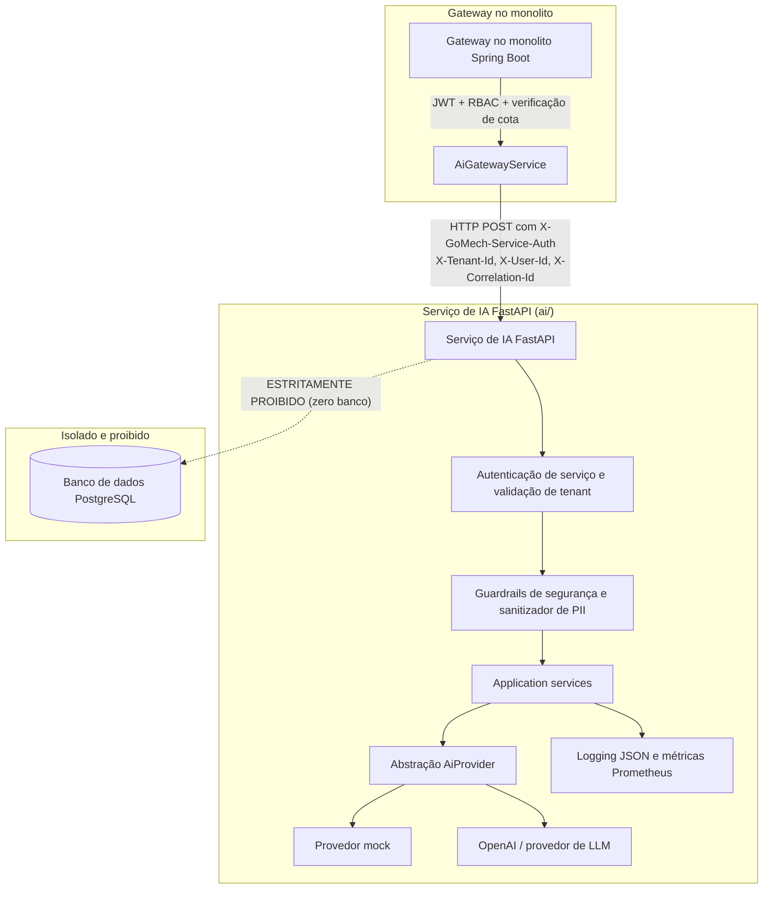

# ADR-019: Isolamento do serviço de IA e arquitetura sem acesso a banco de dados

- **Status:** Aceita

> Numeração anterior: ADR-011 (renumerada para eliminar números duplicados).

## Contexto

O GoMech precisa de recursos avançados de inteligência artificial que abrangem diagnóstico conversacional, análise de sintomas e de códigos de falha DTC, recomendações de peças e de plano de manutenção baseadas no histórico de serviços do veículo, orientação de reparo passo a passo para o mecânico (com especificações de torque), busca de vídeos técnicos de procedimentos, extração de dados de documentos e notas fiscais, rascunhos de comunicação com clientes, geração de propostas de itens de orçamento, resumos de ordens de serviço e insights de analytics.

Embora esses recursos exijam o ecossistema moderno de ML em Python/FastAPI e integrações com provedores externos de LLM, eles trazem riscos arquiteturais sérios se puderem interagir diretamente com a persistência central do negócio:

1. **Bypass de repositórios e dados:** se o serviço de IA pudesse se conectar diretamente ao PostgreSQL ou executar mutações de domínio, contornaria o Row Level Security (RLS) multi-tenant, as permissões RBAC, o log de auditoria e a validação das invariantes de domínio.
2. **Riscos de ações autônomas:** modelos generativos nunca devem, de forma autônoma, alterar registros de cobrança, modificar o histórico do veículo, conceder descontos em ordens de serviço ou disparar mensagens não autorizadas para clientes.
3. **Vendor lock-in:** fixar provedores de modelo externos (OpenAI, Anthropic, Gemini) diretamente nos endpoints cria acoplamento forte e vulnerabilidade operacional durante indisponibilidades do provedor.

## Decisão

O serviço de IA (`ai/`) é projetado e implantado como um **serviço FastAPI independente e stateless, com ZERO CONECTIVIDADE COM BANCO DE DADOS**.

1. **Gateway único e autenticação:**
   - O monolito Spring Boot (`backend/`) é o **único cliente autenticado** autorizado a chamar o serviço de IA.
   - As invocações exigem autenticação service-to-service (`X-GoMech-Service-Auth` ou `Authorization: Bearer <secret>`), além dos headers de escopo de tenant (`X-Tenant-Id`, `X-User-Id`, `X-Correlation-Id`).
   - Requisições sem autenticação ou sem headers de tenant são rejeitadas imediatamente (HTTP 401/400).

2. **Zero acesso a banco de dados (stateless):**
   - O serviço de IA **não tem drivers de banco, ORM, pools de conexão nem credenciais de acesso** ao PostgreSQL.
   - `psycopg`, `psycopg2`, `asyncpg`, `sqlalchemy` e todas as dependências de banco relacional são explicitamente excluídas do `requirements.txt`.
   - Scanners estáticos de AST automatizados (`test_static_ast_codebase_isolation`) e guards de runtime (`verify_zero_database_isolation`) rodam na inicialização e no CI para garantir que não haja nenhum import ou conexão de banco.

3. **Abstrações de provedor intercambiáveis:**
   - Todos os recursos são implementados atrás das interfaces abstratas `AiProvider` e `AiModel` (`app.infrastructure.providers.base.AiProvider`).
   - Os adapters concretos incluem `MockAiProvider` (para desenvolvimento e testes offline determinísticos e de alta fidelidade) e `OpenAIProvider` (com exponential backoff limitado, jitter e tradução automática de falhas).

4. **Propostas em vez de ações diretas:**
   - O serviço de IA retorna apenas estruturas de dados tipadas e propostas estruturadas (`DiagnosticResponse`, `PartsRecommendationResponse`, `QuoteProposalResponse`, `WorkOrderSummaryResponse`).
   - Mutações de domínio (ex.: criar ordens de serviço, adicionar itens de orçamento, atualizar cadastros de clientes) acontecem estritamente dentro do monolito Spring Boot, após revisão e aprovação humana explícita.

5. **Guardrails de segurança automotiva e sanitização de PII:**
   - Entradas e saídas são inspecionadas em busca de instruções automotivas perigosas (ex.: burlar sensores de segurança, dirigir com falha nos freios, intervir em sistemas de alta tensão sem calibração). Violações disparam `GuardrailViolationError` (HTTP 422).
   - Dados pessoais sensíveis (CPF, CNPJ, números de cartão de crédito, endereços de e-mail, telefones e segredos/tokens) são mascarados automaticamente (`[CPF_REDACTED]`, `[SECRET_REDACTED]`) antes do processamento ou do registro em log.

6. **Grounding, confiança e observabilidade:**
   - Recomendações e orientações de diagnóstico incluem scores de confiança explícitos (`confidence_score: float`), citações de grounding (`citations: list[GroundingCitation]`) e avisos de segurança.
   - A observabilidade é feita com logging estruturado em JSON e métricas Prometheus (`ai_requests_total`, `ai_request_latency_seconds`, `ai_tokens_total`, `ai_guardrail_violations_total`).

## Diagrama de arquitetura e fronteiras

## Implementação na GCP

O isolamento de rede ainda não é total. No Terraform (`terraform/modules/gcp/main.tf`), o Cloud Run do serviço de IA usa `ingress = "INGRESS_TRAFFIC_ALL"`: a URL `run.app` aceita conexões da internet. O backend chama essa URL pública e não tem saída pela VPC (Direct VPC egress ou Serverless VPC Access). Por isso, trocar o ingress para `INGRESS_TRAFFIC_INTERNAL_ONLY` hoje faria o Cloud Run recusar as chamadas do próprio backend.

Hoje a restrição é feita por identidade, em duas camadas:

1. **IAM do Cloud Run:** só a service account do backend tem `roles/run.invoker`. O backend envia um ID token com audience do serviço (`GOMECH_AI_ID_TOKEN_AUDIENCE`), e o Cloud Run rejeita qualquer requisição sem token válido antes que ela chegue ao container.
2. **Segredo de serviço:** o FastAPI confere `X-GoMech-Service-Auth` com comparação em tempo constante e não sobe fora de ambientes locais com um segredo público ou curto.

Para ter isolamento também na rede, o próximo passo é ligar Direct VPC egress no backend, com todo o tráfego saindo pela VPC, e mudar o serviço de IA para ingress interno.

## Alternativas consideradas

### Acesso direto do serviço de IA ao banco

- **Rejeitada:** contorna a lógica de domínio do monolito, o contexto de tenancy, as policies de RLS e o log de auditoria.

### Execução de Python embutida no monolito (Jython / execução de processos)

- **Rejeitada:** introduz instabilidade em runtime e vazamento de memória, além de limitar a escalabilidade independente de cargas pesadas de ML.

### Serviço FastAPI independente e stateless (escolhida)

- **Aceita:** independência total de linguagem e runtime, zero risco de bypass de segurança, deploy simples em contêiner e observabilidade completa.

## Consequências

### Positivas

- Segurança estrita: é impossível o serviço de IA contornar o multi-tenancy do banco ou alterar o estado do domínio de forma autônoma.
- Alta resiliência: indisponibilidades do provedor ficam isoladas, com retentativas limitadas e fallback gracioso.
- Auditabilidade completa: todas as requisições são rastreadas de ponta a ponta via `X-Correlation-Id`.
- Escalabilidade independente: o serviço de IA pode escalar horizontalmente sem afetar os pools de conexão com o banco do monolito.

### Negativas

- A comunicação entre o monolito e o serviço de IA adiciona uma latência de rede HTTP mínima (~2–5 ms em ambiente local/VPC).

## Verificação

- Validado por testes unitários, de isolamento e de capacidades (`pytest`):
  - `tests/test_isolation.py`: validação, em runtime e por AST estático, da ausência de módulos de banco.
  - `tests/test_auth.py`: rejeição de requisições não autenticadas ou sem tenant.
  - `tests/test_capabilities.py`: testes de contrato para as 11 capacidades automotivas.
  - `tests/test_guardrails.py`: detecção de violações das regras de segurança e mascaramento de PII.
  - `tests/test_provider_failures.py`: tratamento de timeout, rate limit e erros.
  - `tests/test_observability.py`: métricas Prometheus e health checks.
