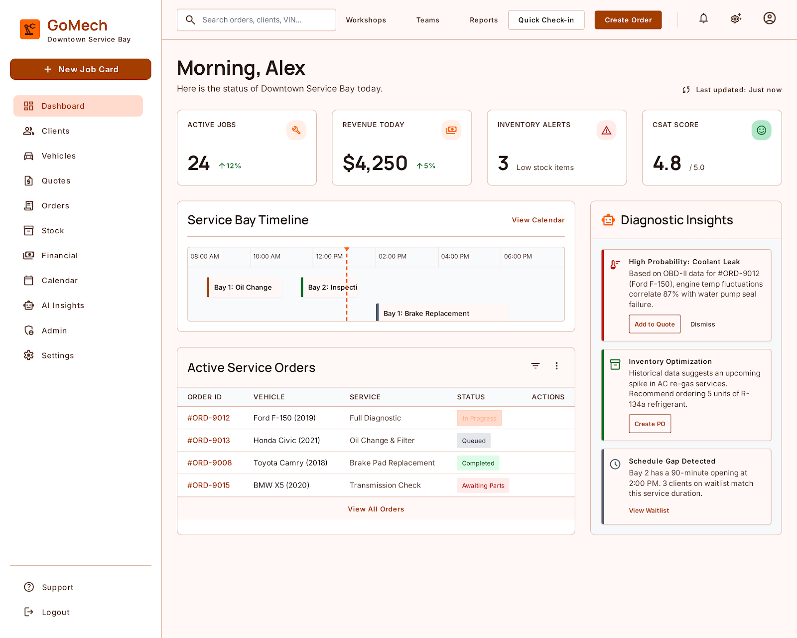
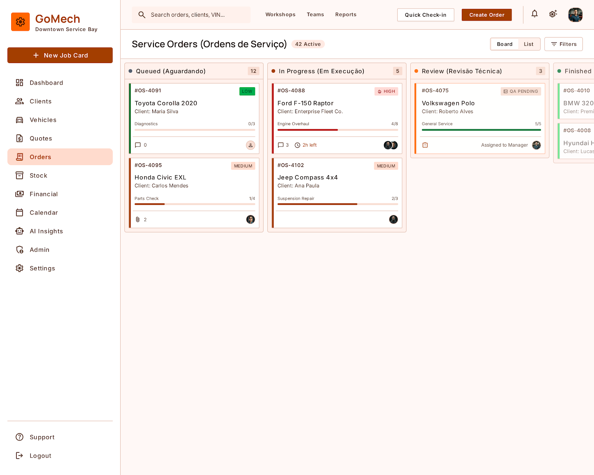
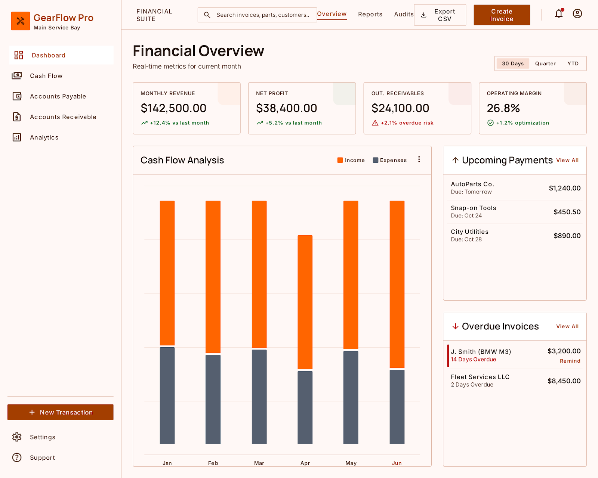
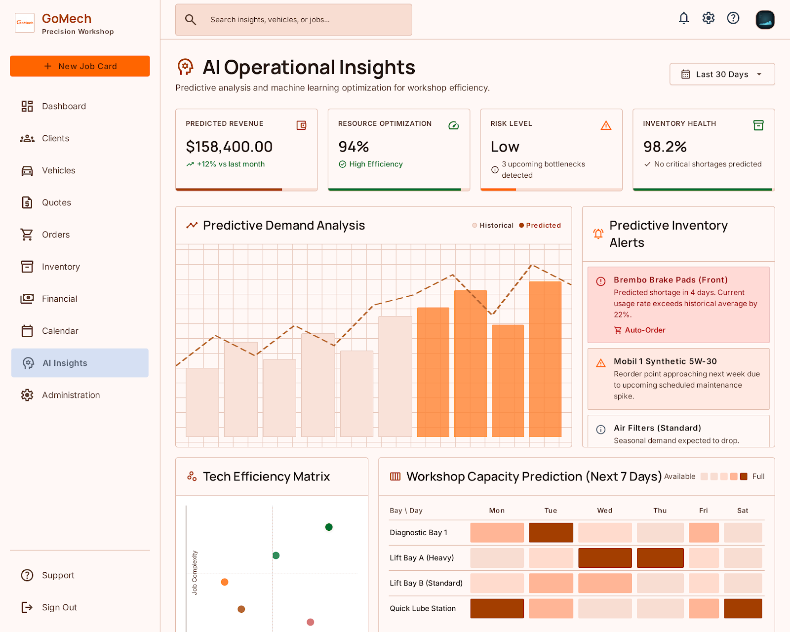

# Design

As telas do GoMech foram desenhadas no **Google Stitch** antes da implementação, com um design system próprio chamado *Mechanical Precision*. Os protótipos estão em inglês e com dados fictícios. A aplicação real é em português e segue o mesmo layout e os mesmos tokens.

- **Tokens de design** (cores, tipografia, espaçamento e raios): [`design-tokens.md`](design-tokens.md)
- **Telas:** cada pasta em [`telas/`](telas) contém `screen.png` (a imagem) e `code.html` (o protótipo HTML/Tailwind exportado pelo Stitch)
- **Como as telas viraram rotas e endpoints:** [guia de implementação do frontend](../FRONTEND_IMPLEMENTATION_GUIDE.md)

<table>
  <tr>
    <td></td>
    <td></td>
  </tr>
  <tr>
    <td align="center">Dashboard principal</td>
    <td align="center">Kanban de ordens de serviço</td>
  </tr>
  <tr>
    <td></td>
    <td></td>
  </tr>
  <tr>
    <td align="center">Dashboard financeiro</td>
    <td align="center">Insights de IA</td>
  </tr>
</table>

## Catálogo de telas

| Área | Telas |
| :--- | :--- |
| Autenticação e onboarding | [Login](telas/autenticacao-login/screen.png) · [Cadastro](telas/autenticacao-cadastro/screen.png) · [Dados da oficina](telas/onboarding-dados-da-oficina/screen.png) · [Seleção de plano](telas/onboarding-selecao-de-plano/screen.png) |
| Dashboard | [Dashboard principal](telas/dashboard-principal/screen.png) |
| Clientes e veículos (CRM) | [Clientes](telas/clientes-listagem/screen.png) · [Novo cliente](telas/clientes-novo-cadastro/screen.png) · [Veículos](telas/veiculos-listagem/screen.png) · [Novo veículo](telas/veiculos-novo-cadastro/screen.png) |
| Agenda | [Calendário mensal](telas/agenda-calendario-mensal/screen.png) · [Check-in diário](telas/agenda-check-in-diario/screen.png) · [Novo agendamento](telas/agenda-novo-agendamento/screen.png) |
| Orçamentos | [Listagem](telas/orcamentos-listagem/screen.png) · [Novo orçamento](telas/orcamentos-novo-orcamento/screen.png) · [Portal de aprovação do cliente](telas/portal-do-cliente-aprovacao-de-orcamento/screen.png) |
| Ordens de serviço | [Listagem](telas/ordens-de-servico-listagem/screen.png) · [Kanban](telas/ordens-de-servico-kanban/screen.png) · [Detalhes](telas/ordens-de-servico-detalhes/screen.png) |
| Estoque | [Produtos](telas/estoque-listagem-de-produtos/screen.png) · [Novo produto](telas/estoque-cadastro-de-produto/screen.png) · [Movimentações](telas/estoque-movimentacoes/screen.png) |
| Financeiro | [Dashboard](telas/financeiro-dashboard/screen.png) · [Contas a pagar](telas/financeiro-contas-a-pagar/screen.png) · [Contas a receber](telas/financeiro-contas-a-receber/screen.png) · [Fluxo de caixa](telas/financeiro-fluxo-de-caixa/screen.png) |
| Assinatura e pagamentos | [Gestão de assinatura](telas/administracao-gestao-de-assinatura/screen.png) · [Checkout](telas/pagamentos-checkout/screen.png) · [Pagamento concluído](telas/pagamentos-sucesso/screen.png) |
| Inteligência artificial | [Insights e dashboard preditivo](telas/ia-insights-dashboard-preditivo/screen.png) |
| Administração | [Usuários](telas/administracao-gestao-de-usuarios/screen.png) · [Papéis e permissões](telas/administracao-papeis-e-permissoes/screen.png) · [Dados da empresa](telas/administracao-configuracoes-da-empresa/screen.png) · [Configurações gerais](telas/administracao-configuracoes-gerais/screen.png) · [Perfil do usuário](telas/configuracoes-perfil-do-usuario/screen.png) |
