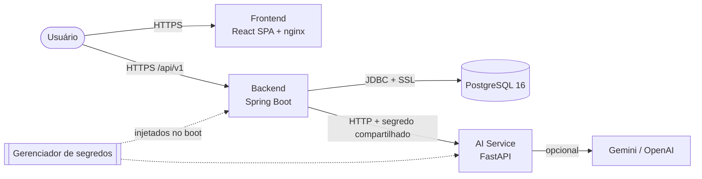

# Infraestrutura como Código (Terraform)

Este diretório descreve a infraestrutura do GoMech em **duas nuvens**, Google Cloud Platform (GCP) e Amazon Web Services (AWS), com Terraform.

> **Contexto:** escrevi os dois módulos para estudar Terraform e as duas nuvens, mapeando a mesma arquitetura para os serviços equivalentes de cada provedor. **O ambiente que está no ar roda na GCP.** Escolhi a GCP porque já tenho o plano Pro do Google, o que simplificou conta e faturamento, e porque o projeto já usa outros serviços do Google (login com Google OAuth e o provider Gemini no serviço de IA). O módulo AWS é válido e documentado, mas não está em uso. A decisão está registrada na [ADR-020](../docs/adr/ADR-020-terraform-multicloud-e-gcp.md).

## Arquitetura



| Componente | GCP (em produção) | AWS (estudo) |
| :--- | :--- | :--- |
| Frontend (SPA) | Cloud Run (nginx) | S3 privado + CloudFront (OAI) |
| Backend | Cloud Run (`min_instances = 1`) | App Runner |
| AI Service | Cloud Run (invocável só pela service account do backend, via IAM) | App Runner |
| Banco de dados | Cloud SQL PostgreSQL 16 (SSL obrigatório, backup diário, HA em produção) | RDS PostgreSQL 16 em subnets privadas (criptografado, Multi-AZ em produção) |
| Rede | Sem VPC dedicada | VPC com subnets públicas e privadas, NAT gateway e VPC connector do App Runner para o backend |
| Segredos | Secret Manager, com acesso por service account | Secrets Manager, lido pela *instance role* do App Runner |
| Imagens | Artifact Registry | ECR Public |

## Estrutura

```text
terraform/
├── modules/
│   ├── gcp/            # módulo reutilizável: APIs, Artifact Registry, service accounts,
│   │                   # Secret Manager, Cloud SQL e 3 serviços Cloud Run
│   └── aws/            # módulo reutilizável: VPC, Secrets Manager, IAM, RDS, App Runner, S3 + CloudFront
└── environments/
    ├── gcp/            # raiz executável (terraform init/plan/apply) para a GCP
    └── aws/            # raiz executável para a AWS
```

Os módulos concentram os recursos. Os ambientes só configuram o provider e repassam variáveis, então um novo ambiente (por exemplo, `staging`) é só mais uma raiz chamando o mesmo módulo.

## Decisões de segurança

- **Nenhum segredo em texto puro nos serviços.** Senha do banco, chave JWT, segredo do AI Service e chaves de API ficam no Secret Manager (GCP) ou no Secrets Manager (AWS) e são injetados como variáveis de ambiente no boot.
- **Menor privilégio.** Na GCP, backend e AI Service rodam com service accounts próprias, e cada uma só lê os segredos de que precisa.
- **AI Service fechado por identidade.** Na GCP, só a service account do backend tem `roles/run.invoker` no AI Service. O header de segredo compartilhado validado pelo serviço é uma segunda camada. O ingress de rede continua `INGRESS_TRAFFIC_ALL`, porque o backend chama a URL `run.app` sem sair pela VPC ([ADR-019](../docs/adr/ADR-019-isolamento-do-servico-de-ia.md#implementação-na-gcp)).
- **Banco privado na AWS.** O RDS fica em subnets privadas, com `publicly_accessible = false`, e o security group só aceita a porta 5432 vinda do VPC connector do backend. Com a saída do backend pela VPC, o NAT gateway mantém o acesso a Google OAuth, Pagar.me e ao AI Service. O NAT gateway tem custo por hora, mesmo sem tráfego.
- **Banco com SSL obrigatório** (`ssl_mode = ENCRYPTED_ONLY` no Cloud SQL, `sslmode=require` no JDBC do profile `prod`).
- **Proteção contra exclusão** e alta disponibilidade (`REGIONAL` / Multi-AZ) ligadas automaticamente quando `environment = "production"`.

## Como provisionar na GCP

**Pré-requisitos:** Terraform >= 1.5, `gcloud` autenticado (`gcloud auth application-default login`) e um projeto GCP com faturamento ativo.

```bash
cd terraform/environments/gcp
cp terraform.tfvars.example terraform.tfvars   # preencha project_id, segredos e imagens
terraform init

# 1. Crie primeiro o Artifact Registry, que recebe as imagens
terraform apply -target=module.gcp_infrastructure.google_artifact_registry_repository.docker_repo

# 2. Publique as imagens (a partir da raiz do repositório)
REPO=us-central1-docker.pkg.dev/<projeto>/gomech-repo
gcloud auth configure-docker us-central1-docker.pkg.dev
docker build -t $REPO/backend:latest ./backend && docker push $REPO/backend:latest
docker build -t $REPO/ai-service:latest ./ai && docker push $REPO/ai-service:latest
docker build -t $REPO/frontend:latest \
  --build-arg VITE_API_URL=https://gomech-backend-<numero-do-projeto>.us-central1.run.app/api/v1 \
  ./frontend && docker push $REPO/frontend:latest

# 3. Provisione o restante
terraform plan
terraform apply
terraform output
```

O `VITE_API_URL` é embutido no bundle na hora do build (é uma variável do Vite, não do container). Como a URL do Cloud Run segue o formato `https://<serviço>-<número-do-projeto>.<região>.run.app`, ela já é conhecida antes do primeiro deploy.

## Como provisionar na AWS

**Pré-requisitos:** Terraform >= 1.5 e AWS CLI configurada (`aws configure`).

```bash
cd terraform/environments/aws
cp terraform.tfvars.example terraform.tfvars
terraform init
terraform plan
terraform apply
```

As imagens do backend e do AI Service devem estar publicadas no ECR Public. O build do frontend vai para o bucket S3 (`aws s3 sync frontend/dist s3://<bucket>`) e é servido pelo CloudFront.

## Provider de IA

Com `gemini_api_key` vazio, o AI Service sobe com o provider `mock`: respostas determinísticas e sem custo. Com uma chave, `DEFAULT_PROVIDER` passa a ser `gemini`.

## Validação

O CI do repositório raiz roda `terraform fmt -check` e `terraform validate` nos dois ambientes a cada push ([.github/workflows/ci.yml](../.github/workflows/ci.yml)).

## Limitações conhecidas e próximos passos

| Tema | Hoje | Próximo passo |
| :--- | :--- | :--- |
| Rede do banco (GCP) | Cloud SQL com IP público, SSL obrigatório e redes autorizadas via `db_authorized_networks` | IP privado + Direct VPC egress no Cloud Run, ou Cloud SQL Auth Proxy |
| Ingress do AI Service (GCP) | `INGRESS_TRAFFIC_ALL`, com acesso restrito por IAM e segredo de serviço | Direct VPC egress no backend e ingress interno no AI Service |
| Estado do Terraform | Local (bloco `backend` comentado nos ambientes) | Bucket GCS/S3 com lock |
| Deploy contínuo | Build e push manuais das imagens | Pipeline (Cloud Build ou GitHub Actions com Workload Identity Federation) |
| Integrações opcionais | Pagar.me, Resend e WhatsApp usam os defaults do backend | Adicionar os respectivos segredos ao módulo |
